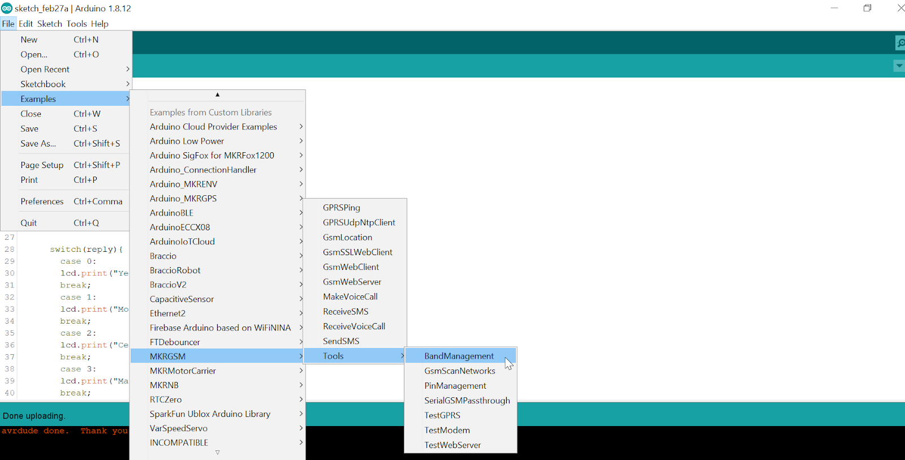

## Overview

It is possible to change the frequencies that our GSM 1400 board uses to connect to the mobile network.
Different options are available to configure the frequency bands on which the MKR GSM 1400 can operate.
This tutorial will show all different possibilities to choose frequency band and how to change this setting.

### What you’ll learn

* How to check and change the operating frequency band/s on our MKR GSM 1400

### What you’ll need

* Arduino IDE
* MKR GSM 1400
* USB data cable

## Steps

1. Check that you have the basics.

   * Make sure you have latest SAMD core. If you don’t, go to Arduino `IDE > Tools > Board > Boards Manager: search for ‘Arduino SAMD Boards’ > Update/Install`

   * Make sure you have the latest update of the MKRGSM’ library: Go to Arduino `IDE > Tools > Library Manager: search for ‘MKRGSM’ > Update/Install`

2. Upload the Band Manager sketch.

   Go to `Arduino > File > Examples > MKRGSM > Tools: ‘BandManagement’` and upload it.

   

3. Manage the board's band frequency

   This sketch, for the MKR GSM 1400 board, checks the band currently configured in the modem and allows you to change it. Make sure you take note of the current option, you might need to configure it back to this one. Just open the serial monitor, the current configuration will show after “Current band”.

   Following, the list of possible options:

   * E-GSM(900)
   * DCS(1800)
   * PCS(1900)
   * E-GSM(900)+DCS(1800) ex: Europe");
   * GSM(850)+PCS(1900) Ex: USA, South Am.
   * GSM800(800)+GSM(850)+E-GSM(900)+PCS(1900)
   * UMTS(2100)
   * GSM(850)+E-GSM(900)+PCS(1900)+UMTS(2100)

   

   If you wish to change the band just enter the corresponding number to the option desired in the input box and press ‘Send’. Success message will be printed right after (the process can take up to 3 minutes).

   

   You can check [here](http://www.worldtimezone.com/gsm.html) which band each zone works with.

   Usual configurations:
   * Europe, Africa, Middle East: E-GSM(900)+DCS(1800)
   * USA, Canada, South America: GSM(850)+PCS(1900)
   * Mexico: PCS(1900)
   * Brazil: GSM(850)+E-GSM(900)+DCS(1800)+PCS(1900)

## Next Steps

Now you have configured the band, get ready and visit [Arduino Project Hub](https://create.arduino.cc/projecthub/search?q=gsm) for inspiration. There are lots of existing projects developed with this board and GSM communication!
