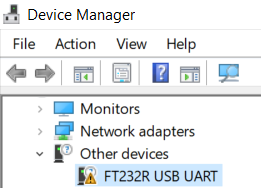

When connecting an FTDI FT232R-based device such as a classic official Arduino Nano to a Windows computer, it may show as a generic "FT232R USB UART" device with a warning sign in the Device Manager.

The problem can be solved by [downloading and installing the latest FTDI driver](https://support.arduino.cc/hc/en-us/articles/4411305694610).
