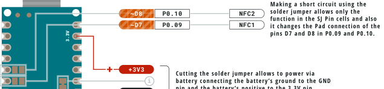

This article explains how to connect the external RFID antenna for the NFC(Near Field Communication) on the Nano BLE boards.

## What you'll need

* Arduino Nano BLE
* Soldering iron
* [List](https://www.digikey.it/products/en/rf-if-and-rfid/rfid-antennas/855?k=nfc%20antenna) of external RFID Antennas

## Connect the antenna

The antenna can be connected in two different ways:

The first is connecting the antenna to the Nano 33 BLE's `P0.09/NFC1` and `P0.10/NFC2` pins. These pins are exposed on the bottom side of the board as shown in the image. Solder the antenna to the pads on the right side only. The left side corresponds to D7 and D8 I/O pins.

The second way is to use a solder to short these pads (NFC1 with D7 and NFC2 with D8), then connect the antenna to the pins marked `D7` and `D8` on the Nano 33 BLE, but then you won't be able to use those pins as normal Arduino pins while the antenna is in use.

Now, you can start programming your Arduino Nano BLE board with an external RFID antenna based on your project requirements.
