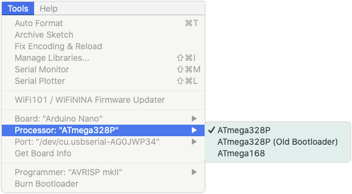

Learn how to select the processor for the Arduino Nano in the Arduino IDE.

---

1. Make sure you have Arduino AVR Boards core 1.16.21 or later installed in the Boards Manager, and that you've selected `Arduino Nano` in `Tools > Board > Arduino AVR Boards`.

2. Open the processor selection menu in `Tools > Processor`.
   * If your Nano was purchased 2018 or later, select `ATmega328P`.
   * If your Nano was purchased 2017 or earlier, select `ATmega328P (Old Bootloader)`.

     

   * If you're unsure which version you have, you can try both to see which works.
