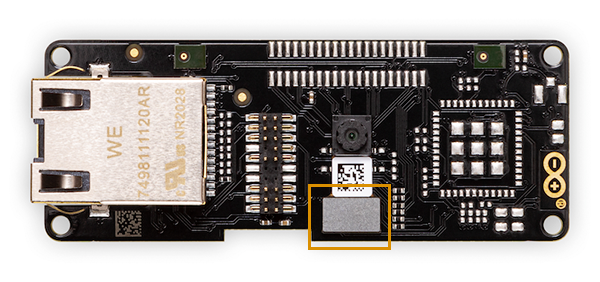

The camera module can be easily detached from the shield thus it can be replaced with another camera module of the same characteristics if necessary.

To detach the camera module from the shield simply use a small flat screwdriver or similar tool and gently pull the metallic plate to detach it from the connector.

To replace the camera module you will need to obtain the image sensor (Himax HM-01B0) with the right connector attached to it. The connector's part number is _BM20B(0.8)-24DP-0.4V(53)_.

The camera module with the connector can be easily mounted on the Vision Shield by manually pushing the connector in place.
