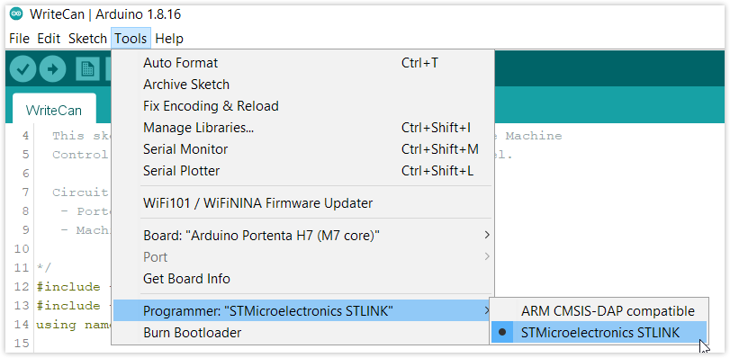

The bootloader is a small program that runs when you turn the Arduino on or press the reset button. Its main function is to receive and write a new sketch to memory. Unsafe code, improper power supply, and short circuits may result in the bootloader being corrupted. Restore the bootloader by following this guide.

---

## What you'll need

* Portenta H7
* [Portenta Breakout](https://store.arduino.cc/products/arduino-portenta-breakout)
* [STLINK programmer for STM32](https://www.st.com/en/development-tools/stlink-v3set.html)
* JTAG connector (STLINK programmer to Portenta Breakout board)
* [Arduino IDE](https://www.arduino.cc/en/software)

## Step-by-step Instructions

1. Attach Portenta H7 to the Portenta Breakout.

2. Connect Portenta H7 to your PC with a USB-C cable.

3. Connect the STLINK programmer to the PC with a USB cable.

4. Connect the JTAG cable from the STLINK programmer to the JTAG on the Breakout.

5. Open Arduino IDE.

6. In the top menu bar, open _Tools > Board_ and select _Arduino Mbed OS Portenta Boards > Portenta H7 (M7 Core)_.

7. Select the programmer in _Tools > Programmer_.

   

8. Select _Tools > Burn Bootloader_ to burn the bootloader.

   

9. Wait for the process to complete.

   
