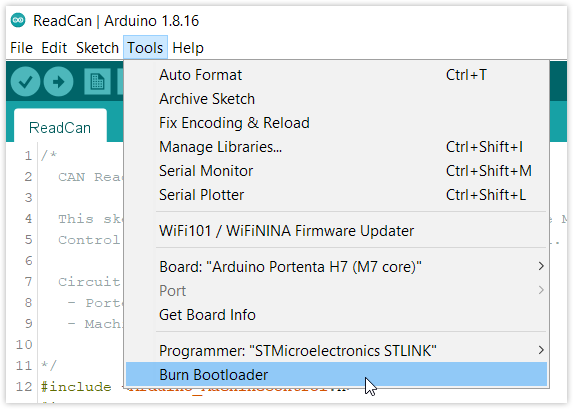
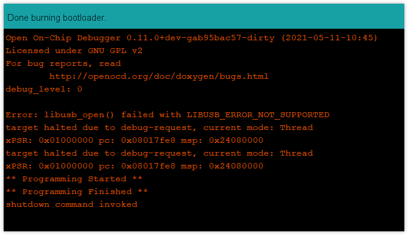

The bootloader program that comes pre-installed in Portenta H7 microcontroller chip can get corrupted when attempting to reprogram the microchip with applications different than Arduino IDE. This kind of action involves a high risk of getting the board bricked thus we strongly not recommend to do this. Also, uploading incompatible code, supplying the wrong power to the board or a short-circuit can also corrupt the bootloader.

## How do I know if the bootloader is present?

The best way to find out if the bootloader is present in the board is to double tap the reset button. After doing this, the built-in LED will fade in and out green. If your board's response to the double tap reset is the described previously then the bootloader is working properly.

## Signs of a missing or corrupted bootloader

Indications of a missing or corrupted bootloader can be:

* Board not detected by the PC and serial port doesn't show up when the board is connected. Neither the device appears in device manager after double tap reset
* Double press reset button does not fade the green LED
* Built-in LED blinks red when board connected. Port doesn't show up preventing sketch upload
* CHRG LED blinks orange every 10-15 seconds
* CHRG LED lights steady orange

## Re-flashing bootloader on Portenta H7

If you have any of the problems above, or simply the serial port does not appear in any PC and sketch upload is not possible, you can try to restore your board by re-flashing the bootloader. To do so, follow the instructions below.

### Requirements

* [STLINK programmer for STM32](https://www.st.com/en/development-tools/stlink-v3set.html)
* [Arduino IDE software](https://www.arduino.cc/en/software)
* Portenta H7 board
* [Portenta Breakout Board](https://store.arduino.cc/products/arduino-portenta-breakout)
* JTAG connector (STLINK programmer to Portenta Breakout board)

### Step-by-step Instructions

1. Attache Portenta H7 to the breakout board
2. Connect Portenta H7 to the PC via USB-C cable
3. Connect the STLINK programmer to the PC via USB
4. Connect the JTAG cable from the STLINK programmer to the JTAG on the Breakout
5. Open Arduino IDE and select Portenta H7 (M7 Core) from the top menu _Tools > Board_
6. Select the corresponding programmer in the top menu _Tools > Programmer_

7. Burn Bootloader: In Arduino IDE top menu go to _Tools > Burn Bootloader_

8. Success message will appear in the Arduino IDE console

