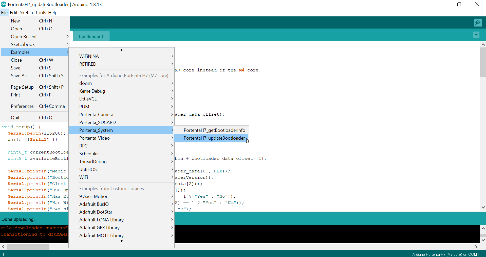
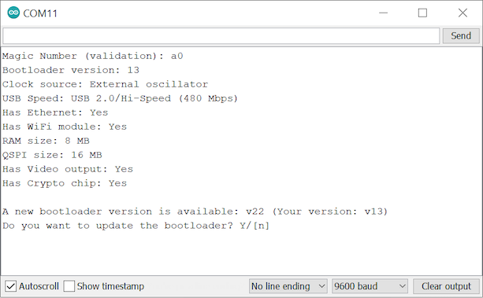
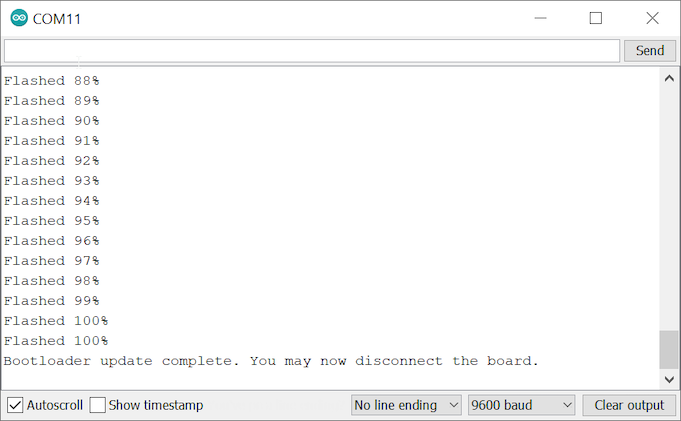

A bootloader is a small application that starts when an Arduino board gets powered. Official Arduino boards come pre-flashed with a bootloader, but to guarantee the best performance and stability it needs to be updated with the latest firmware releases.

---

1. First we must ensure we have the latest version available of the core. Open the Board Manager in the menu under _Tools > Board > Boards Manager..._ and search for "portenta". Find the **Arduino Mbed OS Portenta Boards** package and click on "Install" or "Update" accordingly.

2. Go to _File > Examples > STM32H747_System_ and open the `STM32H747_updateBootloader` sketch.

   

3. Compile and upload the sketch to the board. Make sure you have selected the right port before you upload.

4. Open the Serial monitor and you will see the specifications of your current bootloader and your board. Type `Y` in the text field and press enter to begin the update process.

   

5. You will see the message "Bootloader update complete. You may now disconnect the board." when the update is complete.

   
