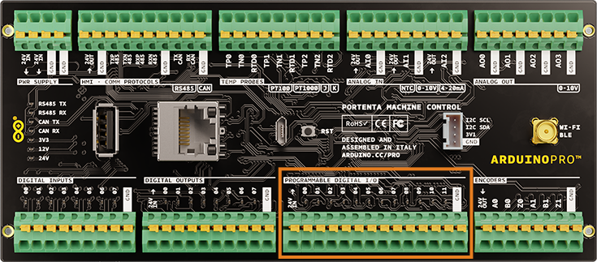
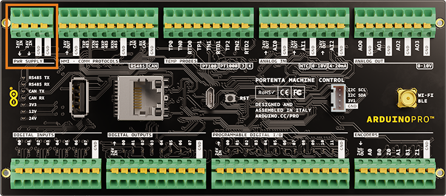

Learn about the power supply requirements for the Portenta Machine Control.

## Upload and run sketches

Connecting a micro USB cable provides sufficient power to upload and run a sketch on the Portenta H7 microcontroller. However, most Portenta Machine Control functionality requires an external power supply, and will not be available in this configuration.

## Connect a power supply

To unlock the full potential of the Portenta Machine Control an external **24 V DC power supply** must be connected.

### Digital output

1. Find the `DIGITAL OUTPUT` pins.
2. Connect a 24 V power supply to the `24V IN` and `GND` pins.

### Digital programmable

1. Find the `PROGRAMMABLE DIGITAL I/O` pins.
2. Connect a 24 V power supply to the `24V IN` and `GND` pins.

### All other pins

1. Find the `PWR SUPPLY` pins.
2. Connect a 24 V power supply to one of the `24V IN` pins.
3. Connect a 24 V power supply to one of the `GND` pins.

This will enable all pins except `DIGITAL OUTPUTS` and `PROGRAMMABLE DIGITAL I/O`.

## Further reading

* [Portenta Machine Control (Arduino Docs)](https://docs.arduino.cc/hardware/portenta-machine-control)
