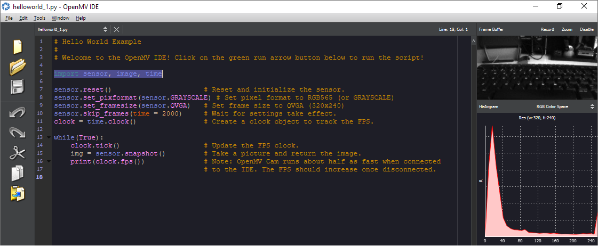

This help center entry is a quick troubleshooting guide to solve no image issue on OpenMV with Portenta H7 and Vision Shield. Please verify and confirm the following checks:

1. Ensure the Vision Shield is securely connected to the Portenta board. Make sure both connectors click and engage properly by gently pushing on either side of the board’s connectors.
2. Ensure all software and firmware is up to date. For that, verify and update the following:
   * Download and install the latest version of Arduino IDE.
   * Install/Update to the latest core version of Arduino Mbed OS Boards: In Arduino IDE go to `Tools > Board > Boards Manager` and search for 'Portenta'. Install `Arduino Mbed OS Portenta Boards` by Arduino.
   * Update Portenta H7 bootloader: In Arduino IDE select the Portenta H7 (M7 core) under `Tools > Board` and then go to `File > Examples > Portenta_System > PortentaH7_updateBootloader. Select 115200 baud rate and proceed with the update following the instructions in the serial monitor.
   * Update OpenMV IDE to [the latest available version](https://openmv.io/pages/download).
     Then you can try to upload and run “helloworld.py” from OpenMV top menu: *file > examples > arduino > basics.* The video image should show up in the video section of OpenMV (top right corner).

For a step-by-step guide on uploading your first program with OpenMV and Portenta Vision Shield, try the [Blob Detection tutorial](https://www.arduino.cc/pro/tutorials/portenta-h7/por-openmv-bt).

If the above did not solve the problem, contact [Arduino Technical Support](https://www.arduino.cc/en/contact-us/).
