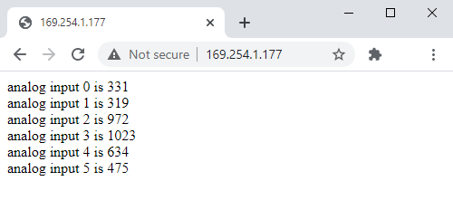

<!-- NOTE: Read about link-local addresses here https://en.wikipedia.org/wiki/Link-local_address -->

## Required hardware

* Ethernet shield
* Arduino Board
* USB cable
* RJ45 Ethernet cable
* A PC with USB and Ethernet ports

## Setup

1. Connect your Ethernet shield to the board
2. Connect the board to your PC using the USB cable
3. Connect the shield to your PC using the RJ45 Ethernet cable

## Upload the sketch

Open the Arduino IDE (if not open) and open the WebServer sketch (File > Examples > Ethernet > WebServer). Make sure to select the port with your board (Tools > Port...).

In the sketch, locate the following lines:

```
// Enter a MAC address and IP address for your controller below.
// The IP address will be dependent on your local network:
byte mac[] = {
  0xDE, 0xAD, 0xBE, 0xEF, 0xFE, 0xED
};
IPAddress ip(192, 168, 1, 177);
```

The last line specifies an IP address. It needs to be replaced with an address in the link-local range (169.254.0.0–169.254.255.255). For example, 169.254.1.100.

Replace the IP address in the sketch with a link-local address. With our example above, it will look like this:

```
IPAddress ip(169, 254, 1, 100);
```

<!-- markdownlint-disable MD038 -->
> Note that the values are delimited by `, ` and not `.`
<!-- markdownlint-enable MD038 -->

Upload the code and open the Serial Monitor (Tools > Serial Monitor).

The following should be output:

```
Ethernet WebServer Example
server is at 169.254.1.100
```

Copy the IP-address and navigate to it using your web browser.



If it looks something like this, your PC is communicating with your board via Ethernet!
