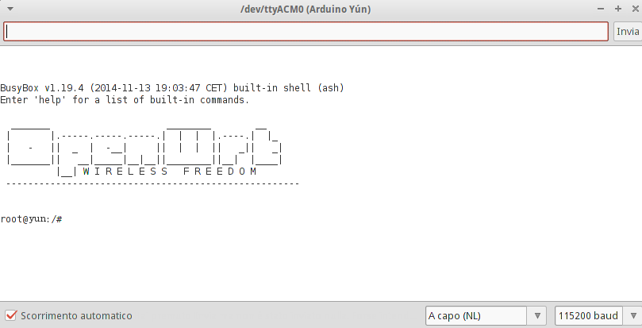

## Overview

This quick tutorial will show you how to reset the **Webpanel** password of your **Arduino Yún Rev 2** in case it got lost or you just want to quickly change it. The old previously set password is not required to perform this action.

## Steps

### Step 0: Upload 'YunSerialTerminal' sketch

Find **YunSerialTerminal** sketch in the Arduino IDE under _File > Examples > Bridge > YunSerialTerminal_.

### Step 1: Open the serial monitor

Once upload is complete open the serial monitor, select **Newline** and **115200** baud in the dropdown menu at the bottom of the serial window. Press _Enter_ to activate the console and `root@YUN:/#` should appear in your serial monitor:

### Step 2: Execute the 'passwd' command

Now you have to execute the **passwd** command to change the password. Type `passwd` into the serial monitor input and press enter. You will be asked to type the new password, and re-type it to confirm. If you want, you can ignore the weak password error. If both passwords you typed match, the console will output `Password for root changed by root` confirmation message. You will then be able to access the webpanel with the new password.

#### Checkpoint

Login to Arduino Yún webpanel and test the new password. Remember that when you first power on the Yún, it will create a Wi-Fi network called ArduinoYun-XXXXXXXXXXXX. Connect your computer to this network, open a web browser, and enter `http://arduino.local` or 192.168.240.1 and login with your new credentials.

Once logged in, the Webpanel also allows you to set a new password, but this way requires the previous password and to connect the Yún to the same network as your PC.

## Alternative way

Alternatively, the password can also be reset by uploading **YunFirstConfig** sketch also found in the _Bridge_ library. Then follow the first config steps as indicated in the [Getting Started](https://www.arduino.cc/en/Guide/ArduinoYunRev2) guide and serial monitor. This process is longer and involves several additional steps, so the first option is recommended if the password cannot be remembered.
