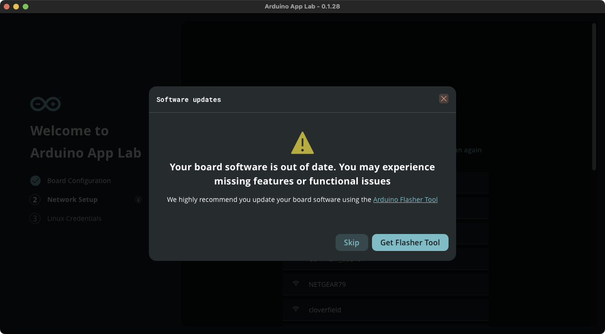

The first Arduino UNO Q boards were shipped with an older software that can't be fully updated by Arduino App Lab. When connecting to a board with outdated software, Arduino App Lab will not be able to fully update it, which can cause certain issues. On Windows, Arduino App Lab may fail to connect to a board with outdated software.

Learn how to tell if your board has outdated software and how to resolve the issue.

In this article:

<!-- TOC -->

- [Recognize outdated software](#recognize-outdated-software)
- [“Error checking for updates” when updating on Windows](#error-checking-for-updates-when-updating-on-windows)
- [Other symptoms of an outdated software on any OS](#other-symptoms-of-an-outdated-software-on-any-os)
- [Flash a new Linux image](#flash-a-new-linux-image)

<!-- /TOC -->

---

## Recognize outdated software

When connecting to a UNO Q in App Lab, or when running App Lab on the UNO Q Single-Board Computer mode, App Lab will display a message warning that your "board software is out of date", and that you should update your board software using the Arduino Flasher Tool.

---

## “Error checking for updates” when updating on Windows

Arduino App Lab on Windows may fail to update to a board with the outdated image. In this case, you will see an **“Error checking for updates”** message.

To successfully update the board, you can:

- [Flash a new Linux image using the Arduino Flasher CLI](https://docs.arduino.cc/tutorials/uno-q/update-image/){.link-external} (recommended)
- Run Arduino App Lab directly on the UNO Q in [Single-Board Computer (SBC) mode](https://docs.arduino.cc/tutorials/uno-q/single-board-computer/) first. When ran in SBC mode, App Lab will be able to update the board. This won’t fix all issues caused by the old image, but it will allow App Lab on your PC to connect successfully.

---

## Other symptoms of an outdated software (on any OS)

Even if you are able to connect to a UNO Q running an outdated image, you may encounter one or more of the following issues:

- **Missing App Lab icon**  
  The App Lab icon may not appear on the desktop or dock, preventing you from easily launching the application.

- **Hostname resolution issues when renaming the board**  
  Changing the board name might cause hostname resolution failures. This is due to a missing package (`libnss-myhostname`) in the older image.

- **Unexpected desktop or application restarts**  
  You may notice random restarts of the desktop environment or applications. This is typically caused by memory pressure. The updated image enables the **ZRAM** kernel module, which compresses RAM to make better use of the available 1.7 GB of memory.

- **ADB connection defaults to root**  
  On older images, the ADB (Android Debug Bridge) connection automatically runs as `root`. The latest image includes a custom-built ADB configuration that resolves this issue.

- **No audio over HDMI**  
  HDMI audio output is not functional on early Linux images and is restored in newer releases.

For the best experience, please [flash the latest Linux image](https://docs.arduino.cc/tutorials/uno-q/update-image/) before using a new Arduino UNO Q.

---

## Flash a new Linux image

To fully resolve the above issues, please flash the board with the latest Linux image.

Follow the step-by-step guide in Arduino Docs:

[Flashing a New Image to the UNO Q](https://docs.arduino.cc/tutorials/uno-q/update-image/){.link-chevron-right}
