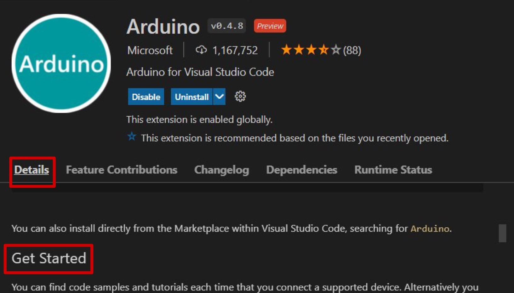

The Arduino CLI on Windows does not have a built-in serial monitor already installed such as Linux and macOS. Therefore, if one wants to access the feature for debugging purposes, some extra steps will need to be taken. Learn how to use alternative methods to view serial communication.

---

## Third-party software

> Note: Please refer to the following links for installation guides on their respective webpage.

* [PuTTY](https://www.chiark.greenend.org.uk/~sgtatham/putty/)
* [Real Term](https://realterm.sourceforge.io/)
* [Tera Term](https://osdn.net/projects/ttssh2/releases/)

## Enable serial communication with an editor

### Platformio (Atom)

1. Download and Install [Atom text editor](https://atom.io/).
2. Open Atom text editor.
3. Locate Atom's package manager under `Menu > File > Settings > Install`.
4. Type 'platformio-ide' in the search field.
5. Click on the install button when _'platformio-ide'_ package is displayed.

Instructions on how to install Platformio packages in Atom's package manager can also be found at [platformio.org](https://platformio.org/install/ide?install=atom).

### Visual Studio Code (Arduino for VS Code)

1. Download and Install [Visual Studio Code editor](https://code.visualstudio.com/docs/?dv=win).
2. Open VS Code environment.
3. Locate the extension's icon on the left panel and click it.
4. Type 'Arduino' in the search field.
5. Click on the Install button when _'Arduino for Visual Studio Code'_ extension is displayed.

For more information on how to integrate the extension with the Arduino CLI read 'Get Started' in the Details section.

## Still need help?

* Additional information regarding the Arduino CLI can be found on the [documentation page](https://arduino.github.io/arduino-cli/0.19/).
