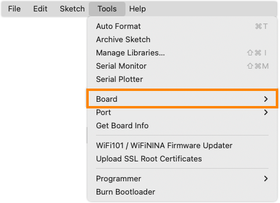
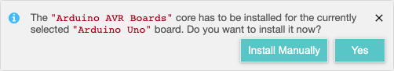

When compiling or uploading, the following error may occur:

```
Compilation error: Missing FQBN (Fully Qualified Board Name)
```

The error occurs if no board has been selected.

Note that a board needs to be selected even if you're not uploading any code (i.e. clicking  Verify).

## Select board

With IDE 2, you can use the board selector menu:

* Connected boards that were identified by Arduino IDE will appear in the list.
* To manually select the board, or to select a board without connecting it, choose _Select other board and port_.


Alternatively, use the _Tools > Board_ menu option:



See [Select board and port in Arduino IDE](https://support.arduino.cc/hc/en-us/articles/4406856349970-Select-board-and-port-in-Arduino-IDE) to learn more.

## Install missing boards

If you do not have the associated board core installed, you may receive the following pop-up.



In this case, choose **Yes** to install the required core.

To learn more about board installation, see [Add boards to Arduino IDE](https://support.arduino.cc/hc/en-us/articles/360016119519-Add-boards-to-Arduino-IDE).
