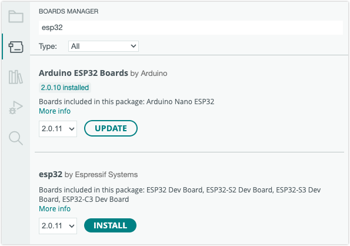

> [!NOTE]
> The esp32 package maintained by Arduino has been renamed to **Arduino ESP32 Boards**.

Version 2.0.10 of the **esp32 board package** introduced a bug[^github-issue][^github-pr] that would cause compilation to fail for some Windows and Linux users.

[^github-issue]: [Core Compilation failure on Linux in v2.0.10 #8424](https://github.com/espressif/arduino-esp32/issues/8424)
[^github-pr]: [2.0.10 escaping fix #8433](https://github.com/espressif/arduino-esp32/pull/8433)

These issues have been fixed in 2.0.11 and later. **[Upgrade the board package](#solution)** to resolve the issue.

---

## Scope of the error

**Windows:**

* Users of Arduino IDE 2 where the `Arduino15` folder path contained a space (typically in the user folder name) were affected.

* Example error output:

  ```
  Access is denied.
  cmd /c type nul > "C:\\Users\\Hannes"     "Siebeneicher\\AppData\\Local\\Temp\\arduino\\sketches\\2B717D34C8CC4EA7678C7773DD033E96/file_opts"
  exit status 1
  Compilation error: exit status 1
  ```

**Linux:**

* Users of Arduino IDE 1 that had installed the software using APT (Advanced package tool) were affected.
* Example error output:

  ```
  Compiling core...
  bash -c "echo '-DARDUINO_CORE_BUILD' > /tmp/arduino_build_925905/file_opts"
  >: -c: line 1: unexpected EOF while looking for matching `''
  >: -c: line 2: syntax error: unexpected end of file
  exit status 2
  Error compiling for board Adafruit® ESP32 Feather.
  ```

---

<a id="solution"></a>

## Solution

Fix the issue by upgrading the board package to 2.0.11 or later:

1. Open the Boards Manager by clicking the  button in the sidebar (IDE 2) or select **Tools > Board > Boards Manager** in the top menu bar.

1. Search for "esp32" to show the **Arduino ESP32 Boards** (Arduino) and **esp32** (Espressif Systems) board packages.

   

1. One or both of these packages will display the text `"2.0.10 installed"`. If you have packages are installed, it is recommended to update both to the latest version. Move your cursor to the board package row, and click the **Update button** (the latest available version is selected by default).
   * In IDE 1, you need to move your mouse cursor inside the board package row to reveal the **Update** button. Also, the option menu for version selection will not show if only one newer version is available. In this case, just click **Update** to install 2.0.11.

1. Wait while Arduino IDE updates the board package.
