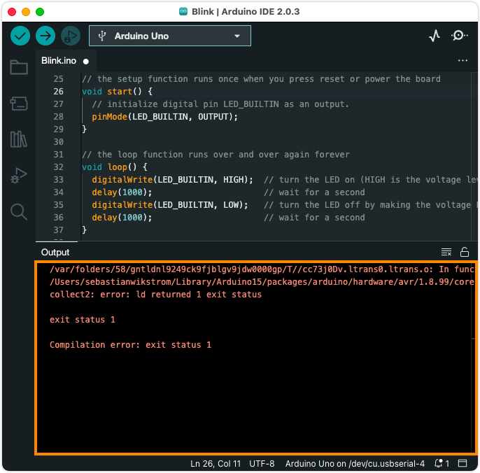
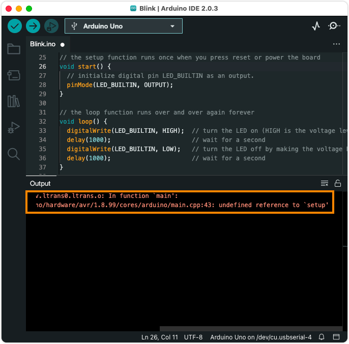

Learn about compilation errors in your sketch and how to resolve them.

In this article:

* [Quick checks](#quick-checks)
* [How to interpret an error message](#how-to-interpret-an-error-message)
* [Troubleshoot a specific error](#troubleshoot-a-specific-error)

---

<a id="quick-checks"></a>

## Quick checks

* Make sure your error occurs during compilation by clicking  **Verify** instead of  **Upload**. This will compile the sketch without attempting to upload it. If your error only occurs when uploading, see [If your sketch doesn't upload](https://support.arduino.cc/hc/en-us/articles/4403365313810-If-your-sketch-doesn-t-upload).

* Make sure you have the right board selected in the board selector or the _Tools > Board_ menu. See [Select board and port in Arduino IDE](https://support.arduino.cc/hc/en-us/articles/4406856349970-Select-board-and-port-in-Arduino-IDE) for more information.

* A successful compilation will always finish with this message (the storage space and memory values might differ depending on the board used):

  ```
  Sketch uses 11604 bytes (4%) of program storage space. Maximum is 262144 bytes.
  Global variables use 2980 bytes (9%) of dynamic memory, leaving 29788 bytes for local variables. Maximum is 32768 bytes.
  ```

* A sketch always needs to include a `setup()` and `loop()` function, even if they're not being used. You can use _File > Examples > 1.Basics > BareMinimum_ as a template.

* Libraries added with `#include` need to be installed. Learn how to [add libraries to Arduino IDE](https://support.arduino.cc/hc/en-us/articles/5145457742236-Add-libraries-to-Arduino-IDE).

---

<a id="interpret"></a>

## How to interpret an error message

To get more information about the error, we need to check the console output. See the example below:

1. If a pop-up notification is still showing, close it by clicking the **x** in the top-right corner.

   

2. Find the console output panel.

   

3. Read the first few lines. The following generic messages may appear near the end of the output:

   * `collect2: error: ld returned 1 exit status`
   * `exit status 1`
   * `Compilation error: exit status 1`

   These generic error messages indicate that the compilation process failed but don't provide specific details about the error, so it's important to read the lines before them.

4. Look for lines starting with file paths. At this point, you may need to resize the window or scroll to the right to reveal the full lines. These files will often be pointing at `main.cpp` function, or a temporary copy of your sketch.

5. In this example, the message <code>...main.ccp:43: undefined reference to \`setup'</code> is the most informative:

   

   In this case, the error was caused by a [missing `setup()` function](#required-functions).

---

<a id="troubleshoot"></a>

## Troubleshoot a specific error

<table>
   <tr>
      <td style="vertical-align: top;">
         <h3>Common</h3>
         <ul>
            <li><a href="https://support.arduino.cc/hc/en-us/articles/4412950941074-Compilation-error-Missing-FQBN-Fully-Qualified-Board-Name-">Compilation error: Missing FQBN (Fully Qualified Board Name)</a></li>
            <li><a href="https://support.arduino.cc/hc/en-us/articles/360020846379-Compilation-error-Platform-not-found-platform-not-installed">Compilation error: Platform not found: platform not installed</a></li>
         </ul>
         <h3>Required functions</h3>
         <ul>
            <li><a href="#required-functions">undefined reference to 'setup'</a></li>
            <li><a href="#required-functions">undefined reference to 'loop'</a></li>
            <li><a href="#required-functions">collect2: error: ld returned 1 exit status</a></li>
         </ul>
         <h3>Libraries</h3>
         <ul>
            <li><a href="#fatal-error-no-such-file-or-directory">fatal error: : No such file or directory</a></li>
         </ul>
      </td>
      <td style="vertical-align: top;">
         <h3>Syntax errors</h3>
         <ul>
            <li><a href="#variable-not-declared">variable was not declared in this scope</a></li>
            <li><a href="#expected-unqualified-id">expected unqualified-id before numeric constant</a></li>
            <li><a href="#expected-before-colon">expected ',' or ';' before ':' token</a></li>
            <li><a href="#expected-bracket">'expected declaration before '}' token', or 'expected '}' at end of
                  input'</a></li>
         </ul>
      </td>
   </tr>
</table>

<!-- REQUIRED FUNCTIONS -->

<a id="required-functions"></a>

### undefined reference to 'setup' or 'loop'<br>collect2: error: ld returned 1 exit status

Occurs when the `setup()` or `loop()` functions are missing. Your sketch _must_ include these functions, even if they're not being used. You can use _File > Examples > 1.Basics > BareMinimum_ as a template. Note that function names are case-sensitive and that the compiler will handle something like `Setup()` (with a capital S) as a completely different function.

<!-- LIBRARIES -->

<a id="fatal-error-no-such-file-or-directory"></a>

### fatal error: \<library\>: No such file or directory

For example:

```
sketch_may11a:22:10: fatal error: KeyboardController.h: No such file or directory
 #include <KeyboardController.h>
          ^~~~~~~~~~~~~~~~~~~~~~
compilation terminated.
exit status 1
KeyboardController.h: No such file or directory
```

1. Check that the library name is spelled correctly and included with the proper format, e.g. `#include <SPI.h>`.
2. Make sure to import the `.h` file.

<!-- SYNTAX -->

<a id="variable-not-declared"></a>

### variable was not declared in this scope

Occurs when a variable is accessed before being declared with the proper syntax, e.g. `int i = 5`, or if the variable is declared outside the current scope.

In this exampled, the variable `i` is declared in the `setup()` function, and then accessed in the `loop()` function.

```
void setup() {
  // put your setup code here, to run once:
  int i = 5;
}

void loop() {
  // put your main code here, to run repeatedly:
  i = i + 1;
}
```

Because the `setup()` function's scope is not accessible from `loop()`, the compiler will return this error:

```
sketch_may16a:3:3: error: 'i' was not declared in this scope
i = 5;
^
exit status 1
'i' was not declared in this scope
```

Instead of declaring `i` in `setup()`, it can be declared as a _global variable_:

```
int i = 5;

void setup() {
  // put your setup code here, to run once
}

void loop() {
  // put your main code here, to run repeatedly:
  i = i + 1;
}
```

<a id="expected-unqualified-id"></a>

### expected unqualified-id before numeric constant

Will occur if a comma (`,`) is used as a decimal separator instead of period (`.`).

This float is incorrectly assigned `1,1`:

```
float f = 1,1;
```

It will trigger this error:

```
sketch_may16a:3:15: error: expected unqualified-id before numeric constant
   float f = 1,1;
               ^
exit status 1
```

Instead, use a decimal point (`.`):

```
float f = 1.1;
```

<a id="expected-before-colon"></a>

### expected ',' or ';' before ':' token

```
sketch_may16a:3:19: error: expected ',' or ';' before ':' token
    int i = 1:
                   ^
exit status 1
```

This error occurs because a line has been ending with a colon (`:`)
instead of a semicolon. (`;`). The line should look like this:

```
int i = 1;
```

<a id="expected-bracket"></a>

### 'expected declaration before '}' token', or 'expected '}' at end of input'

These errors can occur when brackets (`{` and `}` are incorrectly used.

1. Make sure that brackets are opened and closed in the expected order.
2. Use _Tools > Auto Format_ to make your code more readable.
3. If you click on a bracket, the associated opening or closing bracket will be highlighted.

---

## Still need help?

* Arduino sketches are written in the Arduino language, which is based on standard C++ language. Most likely you will find a wealth of resources by searching `C++ <error message>` in your search engine.

* For help with functions specific to Arduino, see the [Arduino functions reference](https://docs.arduino.cc/language-reference/).

* Visit the [Programming Questions category](https://forum.arduino.cc/c/20) in the Arduino forum. Start by reading the pinned threads which will contain useful information on how to best post a question.

* See [Troubleshooting Guide For Arduino > Compiling](https://per1234.github.io/ino-troubleshooting/compiling.html).

<!-- markdownlint-disable-file HC001 -->
