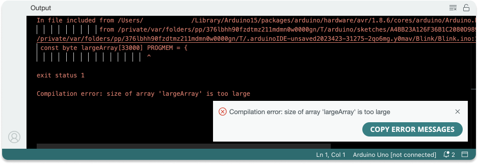

The Arduino IDE/Web Editor checks your sketch's storage space and dynamic memory usage and prints a message after compilation. Learn what these messages mean and how they relate to potential errors. In this article:

* [If the compilation is successful](#if-the-compilation-is-successful)
  * [Potential upload errors](#potential-upload-errors)
* [If the compilation fails](#if-the-compilation-fails)
* [Differences between compilation and upload](#differences-between-compilation-and-upload)

## If the compilation is successful

When the IDE/Web editor successfully compiles a sketch, it prints a message similar to the one below:

This means that the sketch was compiled without errors and gives you an idea of how much storage space and dynamic memory it utilizes. However, errors can occur when you upload the sketch to your board.

### Potential upload errors

The process of uploading a sketch to the board is a separate step from the compilation process. Even if the sketch was compiled successfully, errors can still occur during upload. In this case, the message about sketch size and memory usage will still be printed, but it will be followed by an error message. For example:

In this example, there is an upload error. See [Errors when uploading a sketch](https://support.arduino.cc/hc/en-us/articles/4403365313810-Errors-when-uploading-a-sketch') for more information.

## If the compilation fails

If the compilation fails, the IDE/Web editor will print an error message. For example:

* If the error message suggests issues with the sketch size or memory, check [Reduce the size and memory usage of your sketch](https://support.arduino.cc/hc/en-us/articles/360013825179-Reduce-the-size-and-memory-usage-of-your-sketch) for more information.

* For other compilation errors, see [If your sketch doesn't compile](https://support.arduino.cc/hc/en-us/articles/4402764401554-Compilation-errors-when-uploading).

## Differences between compilation and upload

To put it simply:

* **Compilation** is the process of checking and translating your sketch into machine code (This occurs when you click on the  **Verify** button in the Arduino IDE).

* **Upload** is the process of transferring the compiled sketch into a board. When you click on the  **Upload** button, the sketch is first compiled, and if compilation is successful, it is then uploaded to the board.

These are two distinct steps, and errors may occur in either one.
