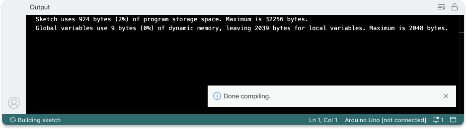
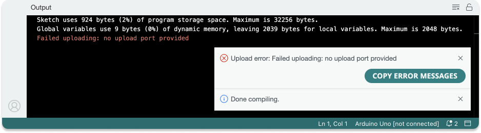
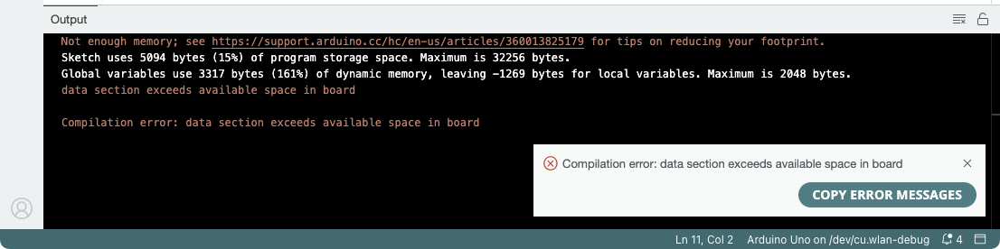

The Arduino IDE/Web Editor checks your sketch's storage space and dynamic memory usage and prints a message after compilation. Learn what these messages mean and how they relate to potential errors.

In this article:

* [When the message is printed](#when-the-message-is-printed)
* [If the sketch size is within board limits](#if-the-sketch-size-is-within-board-limits)
* [If sketch exceeds available space](#if-sketch-exceeds-available-space)

---

## When the message is printed

Whenever you click the  **Verify** or  **Upload** button, the IDE/Web Editor will **compile** your sketch. At the end of the compilation process, it will check that the compiled sketch doesn't exceed the storage limits of the board.

The output will look something like this:

The message is normal and expected output any time you  **Verify** or  **Upload** a sketch.

---

## If the sketch size is within board limits

If both program storage space and dynamic memory usage is **less** than 100%, the compilation process has completed successfully:

* In Arduino IDE, a **"Done compiling"** notification will appear briefly in the bottom-right corner.
* If you clicked the  **Verify** button, nothing more will happen.
* If you clicked the  **Upload** button, the IDE/Web Editor will now try to **upload** the sketch to your board.

### Console output during sketch upload

The process of uploading a sketch to the board is a separate step from the compilation process. When the sketch is being uploaded, additional lines may be printed depending on your board and editor settings. In some cases, warnings or other messages from the underlying upload tools may appear. In other cases, nothing may be printed during the upload process. **Errors that occur during upload are unrelated to the sketch size and memory usage message**.

Some upload tools and protocols may not print any message to console to indicate a successful upload. Instead, look for the following:

* In Arduino IDE, a **"Done uploading"** notification appears in the bottom-right corner.
* In the Web Editor, the console border turns green with a **"Success"** message.
* The upload tool may print warnings or other information, sometimes highlighted in red, but the output does **not** end with a `Failed uploading` message.

Unless the console output ends with a `Failed upload` error message, the upload process was probably successful. **If you're unsure, try using the board in your project and see if it works as expected**, or upload a simple example like Blink (File > Examples > 01.Basics > Blink).

If a `Failed uploading` error did occur, it's important to note that it's not related to sketch size and memory usage. Instead, see [Errors when uploading a sketch](https://support.arduino.cc/hc/en-us/articles/4403365313810-Errors-when-uploading-a-sketch) for help with troubleshooting uploads.

---

## If sketch exceeds available space

If either program storage space or dynamic memory usage is **more** than 100%, you will get a compilation error:

* The compilation error message will be one of the following:
  * `data section exceeds available space in board` – occurs if program storage space is **more** than 100%.
  * `text section exceeds available space in board` – occurs if dynamic memory is **more** than 100%.
* See [Reduce the size and memory usage of your sketch](https://support.arduino.cc/hc/en-us/articles/360013825179-Reduce-the-size-and-memory-usage-of-your-sketch).

---

## Further reading

* For other compilation errors, see [If your sketch doesn't compile](https://support.arduino.cc/hc/en-us/articles/4402764401554-Compilation-errors-when-uploading).
