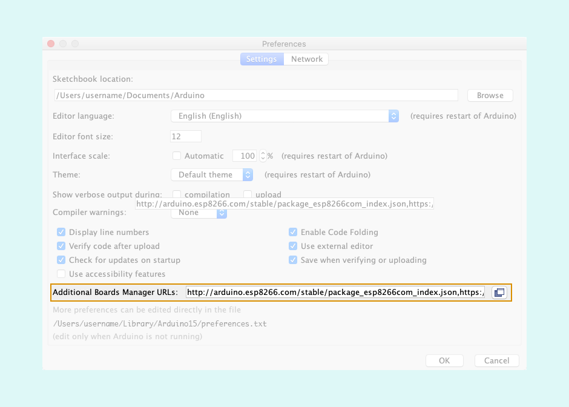
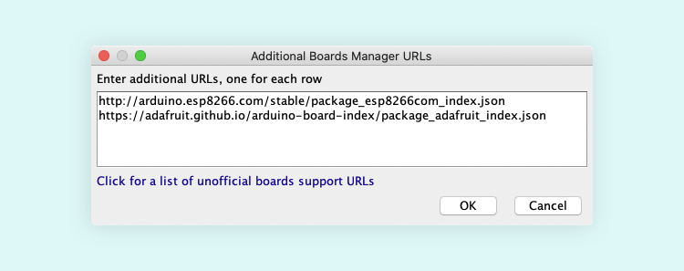

Third-party board platforms can be added to the Board Manager in Preferences.

## Configure additional Board Manager URLs

1. Open Preferences
   - **Windows/Linux:** `File > Preferences`
   - **macOS:** `Arduino > Preferences`

2. Click on the button to the right of the _Additional Boards Manager URLs_ text field.

   

3. Paste or remove URLs in the window. There should be one URL for each line.

   > Removing URLs will not automatically remove the files from your computer. If you want to completely remove a package, uninstall it from the Boards Manager first.

   

4. Click OK.

5. Click OK in Preferences to save the changes.

New packages will be downloaded the next time you open the Boards Manager.

## Find Board Manager URLs

[An unofficial list of third-party boards support urls can be found here](https://github.com/arduino/Arduino/wiki/Unofficial-list-of-3rd-party-boards-support-urls).
