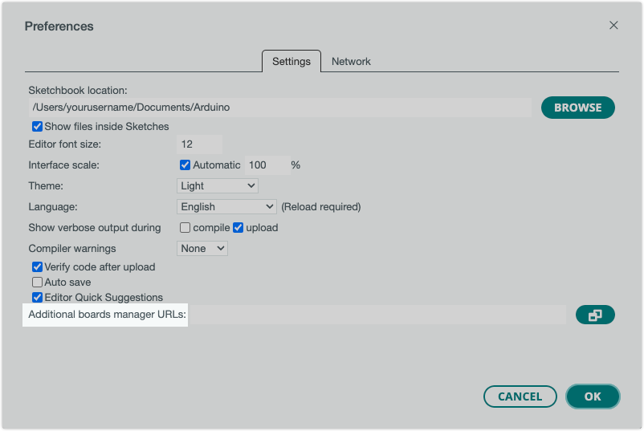
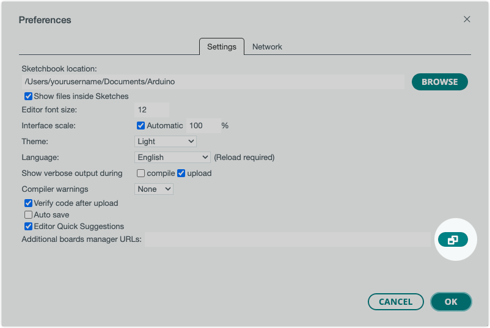
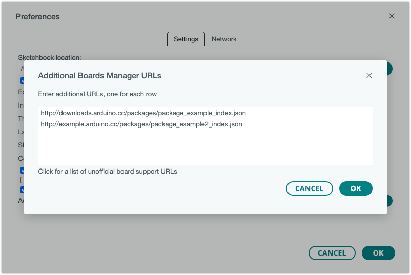

## About third-party platforms

By the default, Arduino IDE installs and updates the board platforms from the official Arduino package list[^1]. This lets you install and update Arduino platforms, for use with official Arduino boards, as well as third-party boards compatible with the official Arduino platform.

The Board Manager can also be used for conveniently installing and updating platforms that are not in the official package list, if the creator provides a **platform index URL** (ending with `_index.json`). You can use this URL to [configure additional Board Manager URLs](#add-or-remove).

These are some reasons you may want to an additional Board Manager URL:

* Add support for a platform created by a third-party manufacturer
* Add platforms created by the open source community
* Testing a beta release that hasn't been added to the official list

If you have a "clone" UNO or Nano board, you will probably want to use the corresponding Arduino board from the **Arduino AVR Boards platform**, which is available in the Boards Manager by default. To learn how to install a platform already available in the Boards Manager, see [Add boards to Arduino IDE](https://support.arduino.cc/hc/en-us/articles/360016119519-Add-boards-to-Arduino-IDE).

[^1]: <https://downloads.arduino.cc/packages/package_index.json>

---

## Add or remove additional Board Manager URLs

Follow these steps:

1. Open Preferences using the menu bar:

   * Windows/Linux: **File > Preferences**
   * macOS: **Arduino IDE > Preferences**[^2]

   [^2]: If you're using Arduino IDE 2.1 or older, this option may be called **Arduino IDE > Settings**. ([#2022](https://github.com/arduino/arduino-ide/issues/2022))

2. Find the **Additional boards manager URLs** setting toward the bottom.

   > **Note:** If you can't find the setting, put your cursor in the middle of the Preferences window and scroll down.

   

3. Click the button to the right of the text field to open the **Additional Boards Manager URLs** window.

   

4. Paste or remove URLs in the window. There should be one URL for each line.

   

5. Click **OK** to close the Additional Boards Manager URLs window.

6. Click **OK** again to close Preferences and save the changes.

7. Open the  **Boards Manager** to update the package list.

---

## Further reading

* [Unofficial list of 3rd party boards support urls](https://github.com/arduino/Arduino/wiki/Unofficial-list-of-3rd-party-boards-support-urls)
* [Package index specification](https://arduino.github.io/arduino-cli/0.32/package_index_json-specification/)
* [Installing additional cores](https://docs.arduino.cc/learn/starting-guide/cores)
