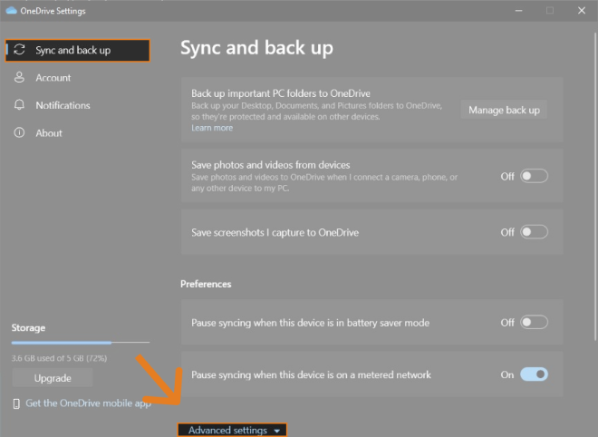
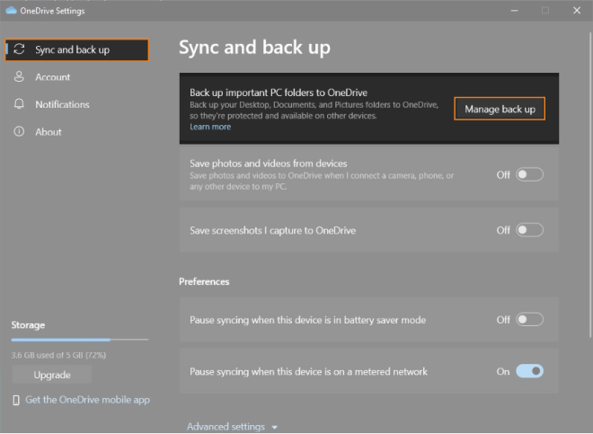
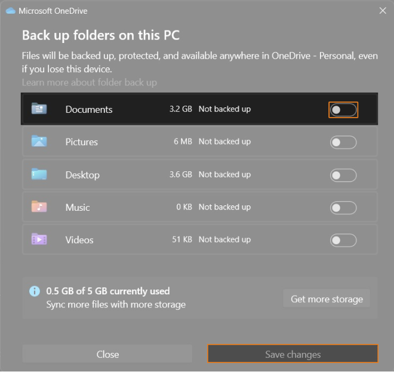

The Microsoft OneDrive On-Demand and the back up features can result in essential files not being available or synchronized. This can lead to issues when starting Arduino IDE on Windows (the initialization window appears and disappears without showing any error message or warning), or to errors during compilation. Learn more about possible solutions.

---

## Disable the On-Demand feature

1. Make sure that your internet connection is stable.
2. Open Microsoft OneDrive (look for the OneDrive icon inside the system tray at the bottom-right of the taskbar):

   

3. Click on the settings icon and go to "Settings":

   

4. Go to "Sync and back up" and click on "Advanced settings":

   

5. Scroll down to "Files-On-Demand" and choose "Download all files":

   

6. Allow some time for OneDrive to download the files.

## Re-install IDE outisde the OneDrive folder

1. [Uninstall Arduino IDE](https://support.arduino.cc/hc/en-us/articles/360021325733-Uninstall-Arduino-IDE) from your computer.
2. [Install Arduino IDE](https://support.arduino.cc/hc/en-us/articles/360019833020-Download-and-install-Arduino-IDE) outside the OneDrive folder. For example:
   * `C:\Program Files\Arduino IDE` or `C:\Users\username\AppData\Local\Programs\Arduino IDE`
   * Avoid paths like: `C:\Users\username\OneDrive\Documents\Arduino\...`

## Disable back up for the IDE location

Having the IDE installed in a folder that is backed up by OneDrive (e.g. "Documents") can result in essential files not being available or synchronized. Follow these steps to disable automatic back up:

1. Make sure that your internet connection is stable.
2. Open Microsoft OneDrive (look for the OneDrive icon inside the system tray at the bottom-right of the taskbar):

   

3. Click on the settings icon and go to "Settings":

   

4. Go to "Sync and back up" and click on "Manage back up": 

   

5. Disable the back up option for the folder containing Arduino IDE and click "Save changes":

   
   