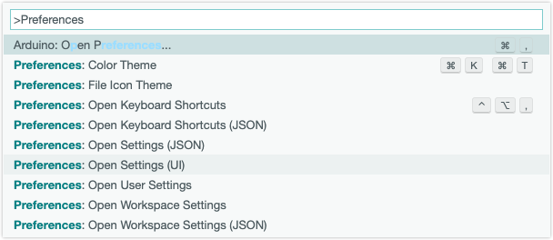
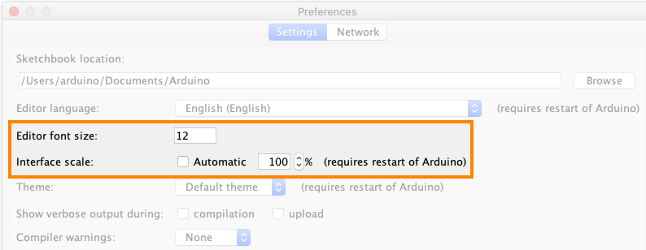

Learn how to control text and display size in Arduino IDE.

In this article:

* [Change font settings in Arduino IDE 2](#ide2)
* [Change font settings in Arduino IDE 1](#ide1)

---

## Change settings in Arduino IDE 2

### Change settings in Preferences

1. Open Preferences from the menu bar, or use the keyboard shortcut:
   * **File > Settings** (Windows/Linux) / **Arduino IDE > Settings** (macOS).
   * `Ctrl` + `,` (Windows/Linux) / `⌘` + `,` (macOS).

2. Change the font size or interface scale settings:

   * **Editor: Font Size** – Controls the editor and output console text size in pixels (default: 12).
   * **Interface scale** – Changes the size of all UI elements (default: 100%)

   

3. Click the **OK** button to confirm the changes.

### Change settings in user or workspace settings

For more advanced settings, you need to use the

1. Use one of these keyboard shortcuts to open the **Command Palette**:

   * Press `Ctrl`+ `Shift` + `P` (Windows/Linux) / `⌘` + `Shift` + `P` (macOS)

   * Press `F1`.

2. In the list of commands, find and select **Preferences: Open Settings (UI)**.

   

3. Check the **Commonly Used** group at the top, use the sidebar, or try typing "font" in the search bar.

4. These are some settings that you can use to control the way text is displayed in Arudino IDE 2:

   * **Editor: Font Size** – Controls the font size in pixels.
   * **Editor: Font Family** – Controls the font family.
   * **Editor: Font Weight** – Controls the font weight. Accepts "normal" and "bold" keywords or numbers between 1 and 1000.
   * **Terminal › Integrated: Font Size** – Controls the font size in pixels of the terminal.

5. When you're finished, close the Preferences tab to return to your sketch.

> [!NOTE]
> By default, the **User** tab is selected. This means the settings will apply globally to any instance of Arduino IDE. Alternatively, you can edit settings the **Workspace** tab, which will apply only to sketch that's open when making the change.

**[Learn more about user and workspace settings in Visual Studio Code Docs.](https://code.visualstudio.com/docs/getstarted/settings)**

---

## Change settings in Arduino IDE 1

### Change settings in Preferences

1. Open Preferences from the menu bar, or use the keyboard shortcut:
   * **File > Settings** (Windows/Linux) / **Arduino > Settings** (macOS).
   * `Ctrl` + `,` (Windows/Linux) / `⌘` + `,` (macOS).

2. Change the font size or interface scale settings:

   * **Editor: Font Size** – Controls the editor and output console text size in pixels (default: 12).
   * **Interface scale** – Changes the size of all UI elements (default: 100%).

   

3. Click the **OK** button to confirm the changes.

4. If you made changes to the **scale** setting, you need to restart the IDE for the changes to take effect.

### Making changes in the preferences.txt file

1. Open Preferences from the menu bar, or use the keyboard shortcut:
   * **File > Settings** (Windows/Linux) / **Arduino > Settings** (macOS).
   * `Ctrl` + `,` (Windows/Linux) / `⌘` + `,` (macOS).

2. In Preferences, look for the link to the `preferences.txt` file in the bottom-right corner. Click on it to open the [Arduino15 folder](https://support.arduino.cc/hc/en-us/articles/360018448279-Open-the-Arduino15-folder) in your system's file manager.

3. Close Arduino IDE.

4. Open the `preferences.txt` file with a text editor.

5. Look for the line starting with `editor.font`. Replace the current font (after the equals sign) with a preferred font available on your system.

6. Save your changes to the file.

7. Re-open the IDE to see the changes implemented.
