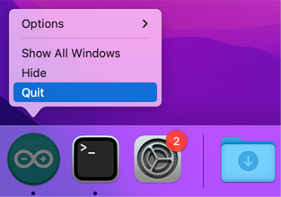

The original language for the Arduino IDE interface is English, but other languages are available.

---

## Change the language in Preferences

1. Open Arduino IDE.

2. Open preferences: Choose **File > Preferences** in the menu bar for Windows/Linux, or  **Arduino IDE > Preferences**[^1] for macOS.

   [^1]: In some versions of Arduino IDE, this option may be called **Arduino IDE > Settings**. ([#2022](https://github.com/arduino/arduino-ide/issues/2022))

   Alternatively, use keyboard shortcuts to open the window: <kbd>Ctrl</kbd> + <kbd>,</kbd> for Windows/Linux and <kbd>⌘</kbd> + <kbd>,</kbd> for macOS.

3. Click the **Language** option and select your desired language.

   

4. Click OK to confirm the changes.

5. Restart the IDE for the changes to take effect.

---

## Change the language by editing preferences.txt

Alternatively, you can edit the `preferences.txt` file directly.

1. Close Arduino IDE.

2. [Open the Arduino15 folder](https://support.arduino.cc/hc/en-us/articles/360018448279-Open-the-Arduino15-folder).

3. Open `preferences.txt`.

4. Find the `editor.languages.current` line.

5. Edit the value to read `editor.languages.current=en`.

6. Save the file.

7. Open Arduino IDE to see the changes.

---

## If the language isn't changing

Make sure you fully restart Arduino IDE. On macOS, closing all windows will not automatically quit the application. If the Arduino IDE icon is in the Dock with a small dot below it, the app is still running. Right-click on the icon and select _Quit_ to quit the app.

Note that modifying the language preferences in the IDE will not affect the language of some messages printed in the "Output" view.

  Tags: sprache, idioma, Español, Deutsch, Italiano  (Italian), Português, Arabic, Euskara (Basque), Chinese (汉语/漢語), Čeština (Czech), Dutch, Persian, Turkish, Armenian, Bulgarian , English, French, German, Greek, Hungarian, Italian, 日本語 (Japanese), 한국어 (Korean), Norwegian Bokmål, Polish, Portuguese, Limba română (Romanian), Russian, Slovenčina (Slovak), Slovenian ,Spanish ,Ukrainian ,Vietnamese, Eesti keel (Estonian)

