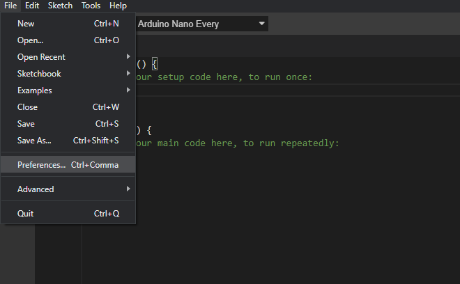
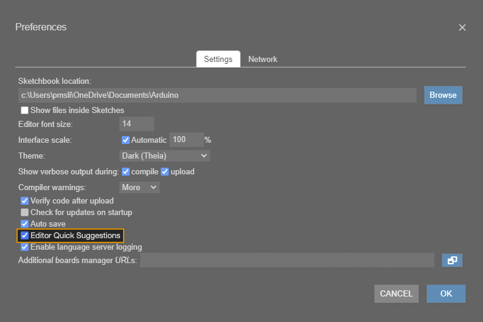

Arduino IDE 2 introduces an autocomplete feature for writing your code. Follow these steps to enable the feature.

1. Open the IDE.

2. Open the Preferences window.

   * **Windows/Linux:** `File > Preferences`.

   * **macOS:** `Arduino IDE > Preferences`

   

3. Check the _Editor Quick Suggestions_ box and click OK to save.

   > Note that there is a [bug](https://github.com/arduino/arduino-ide/issues/313) (on version 2.0.0-beta.11 and earlier) that causes the box to appear unchecked when the preference window is opened, even if the feature is enabled.

   

Autocomplete is now enabled:

