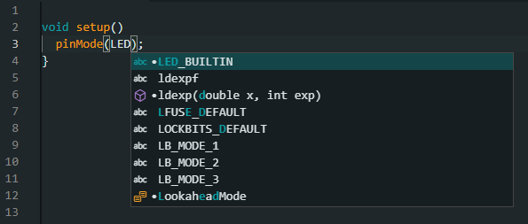

Arduino IDE 2 introduces **Editor Quick Suggestions**. When enabled, Arduino IDE will provide suggestions to automatically complete code as you type. Editor Quick Suggestions is sometimes referred to as **autocomplete**.

---

Follow these steps to enable Editor Quick Suggestions:

1. Open Arduino IDE.

2. Open the Preferences window from the menu bar:

   * Windows/Linux: **File > Preferences**

   * macOS: **Arduino IDE > Settings**

3. Check the box next to *Editor Quick Suggestions*.

   

4. Click OK to save.

Editor Quick Suggestions are now enabled:

