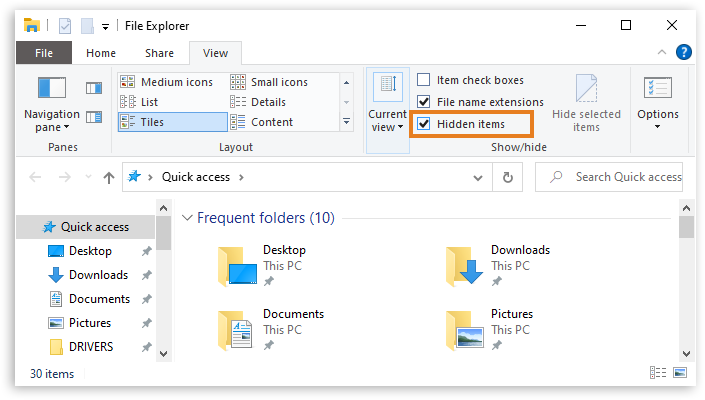
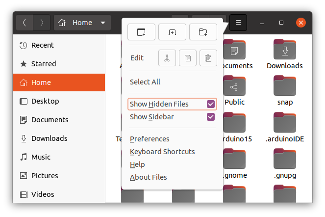

Learn how to open the Arduino15 folder on your system.

---

## Windows

**For a standard Arduino IDE installation** the folder is found at `C:\Users\{username}\AppData\Local\Arduino15`.

1. Open your user folder in Explorer.

2. Look for a folder with the name `AppData`. This folder is hidden by default. In newer versions of Windows, you can display hidden items by clicking the **View** tab, and checking _Hidden items_.

   

   > On Windows 7, the setting can be accessed from Explorer by clicking the **Organize** button, opening the **View** tab and selecting _Show hidden, files, folders and drives_ in the _Hidden files and folder_ section.

3. Open the `Appdata` folder.

4. Open `Local`.

5. Open `Arduino15`.

**If you installed Arduino IDE from the Windows Store** the folder is named `ArduinoData`, and is in a different location:

1. Open your user folder in Explorer.

2. Open your Documents folder.

3. Open the `ArduinoData` folder.

---

## macOS

1. Open Finder.

2. In the menu, click _Go_.

3. Hold the _option_ key. A _Library_ row will appear in the menu. Click it.

4. Within the Library folder, open `Arduino15`.

Full path: `/Users/{username}/Library/Arduino15`

---

## Linux

The folder is located in `/home/{username}/.arduino15` and is hidden by default. To show it, click the hamburger button and check _Show Hidden Files_. You may have to scroll down to see it since files with the `.` prefix may be listed after the others.

> [!NOTE]
> By default the folder is hidden; therefore, if you're unable to locate the .arduino15 folder please refer to the bottom of the page.

---

## Further reading

* [Find sketches, libraries, board cores, and other files on your computer](https://support.arduino.cc/hc/en-us/articles/4415103213714-Find-sketches-libraries-board-cores-and-other-files-on-your-computer)
