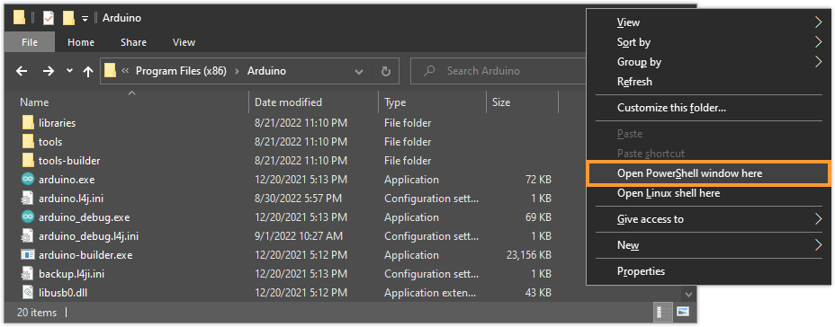
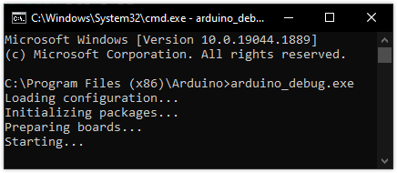
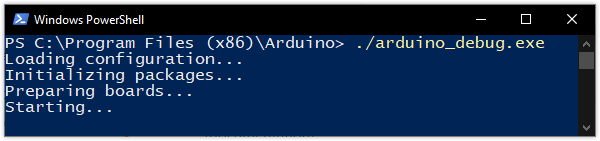
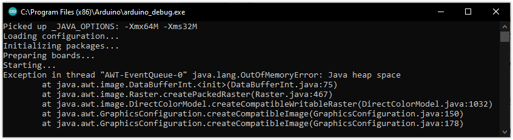

Arduino IDE 1.x for Windows includes an alternative executable that provides log output to use for troubleshooting problems with the IDE.

---

## Running `arduino_debug.exe`

1. Start File Explorer (AKA Windows Explorer).

2. [Open the Arduino IDE installation folder](https://support.arduino.cc/hc/en-us/articles/4412943340178-Open-the-Arduino-IDE-installation-folder) (in `C:\Program Files (x86)\Arduino` by default).

3. Inside the installation folder, hold the <kbd>Shift</kbd> key while right-clicking an **empty** area in the window (not on a file.

   * If _"Open PowerShell window here"_ is available, click it to open **PowerShell**.
   * If _“Open command window here"_ is available, click it to open **cmd.exe**.

   

4. The command shell window will open.

   * If you're using cmd.exe, enter `arduino_debug.exe` and press <kbd>Enter</kbd>.

     

   * If you're using PowerShell, enter `./arduino_debug.exe` and press <kbd>Enter</kbd>.

     

5. Debug output should now be printed as Arduino IDE starts (or fails to start).

---

## Interpreting the output

_java.lang.OutOfMemoryError after launching Arduino IDE_

### `Picked up _JAVA_OPTIONS`

This message indicates that the `_JAVA_OPTIONS` environmental variable is configured on your system. While not an error in itself, the set options may cause problems when running the IDE. Be on the lookout for the `-Xmx` and `-Xms` flags, which control maximum and initial heap size (memory).

### `Exception in thread java.lang.OutOfMemoryError: Java heap space`

The maximum Java heap size was exceeded. Can be caused by a low setting for `-Xmx` (the default value is `-Xmx512M`).

### `Error occurred during initialization of VM`

A generic error indicating that the Java Virtual Machine could not be started.

---

## Checking and changing Java VM options

See the steps outlined in [Error: Could not create the Java Virtual Machine (Windows)](https://support.arduino.cc/hc/en-us/articles/360021218899-Error-Could-not-create-the-Java-Virtual-Machine-Windows-).

<!-- Tags -->

   AWT-EventQueue-0

<!-- markdownlint-disable-file HC001 -->
