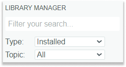
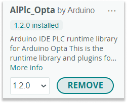

There are two ways of removing libraries:

* [Uninstall libraries with the Library manager (requires IDE 2)](#library-manager). Easy way to remove individual libraries.
* [Remove libraries with your file manager](#file-manager). A better option if you want to remove many libraries and it works for all versions of the IDE.

---

## Uninstall libraries with the Library manager

The Library Manager in Arduino IDE 2 can be used to uninstall individual libraries:

1. Click the  **Library Manager** button or select _Tools > Manage Libraries..._ in the menu bar.

   

2. Filter your search:

   * For the Type option, select **Installed** to show only installed libraries
   * To further filter the results, type the library name into the text field.

   

3. Find the library in the search results. Note that the results are listed alphabetically.

4. Put your mouse cursor over the INSTALLED label and click UNINSTALL to uninstall the library.

   

5. Confirm that you want to uninstall the library by clicking **Yes**.

---

## Remove libraries with your file manager

Removing the library files directly is the most reliable method that will work for versions of Arduino IDE and library types.

### Library Manager, "Add .ZIP Library", and manual installs

Most libraries are located in the Sketchbook library folder, including:

* Libraries installed with the Library Manager
* Libraries imported with _Sketch > Include library > Add .ZIP library..._
* Any other libraries manually moved into the folder

Follow these steps to remove these libraries.

1. [Open the Sketchbook](https://support.arduino.cc/hc/en-us/articles/4412950938514-Open-the-Sketchbook).
2. Go into the `libraries` subfolder.
3. Delete the folder for libraries you want to uninstall.
4. Restart Arduino IDE.

### Libraries bundled with board platforms

Some board platforms are packaged with libraries, that are saved within the [Arduino15 folder](https://support.arduino.cc/hc/en-us/articles/360018448279), inside the `Arduino15/packages/<vendor>/hardware/<board platform>/<version>/libraries` subfolder.

They are written specifically for the boards of that platform and are only accessible when one of those boards is selected in the _Tools > Board_ menu. They will be removed when [uninstalling the board platform](https://support.arduino.cc/hc/en-us/articles/4407225360018). Removing them is not recommended. If doing so, included examples may stop functioning. The libraries will be reinstalled if the package is updated by the Board Manager.

---

## Further reading

* [Find sketches, libraries, board cores, and other files on your computer](https://support.arduino.cc/hc/en-us/articles/4415103213714-Find-sketches-libraries-cores-and-other-files-on-your-computer).
