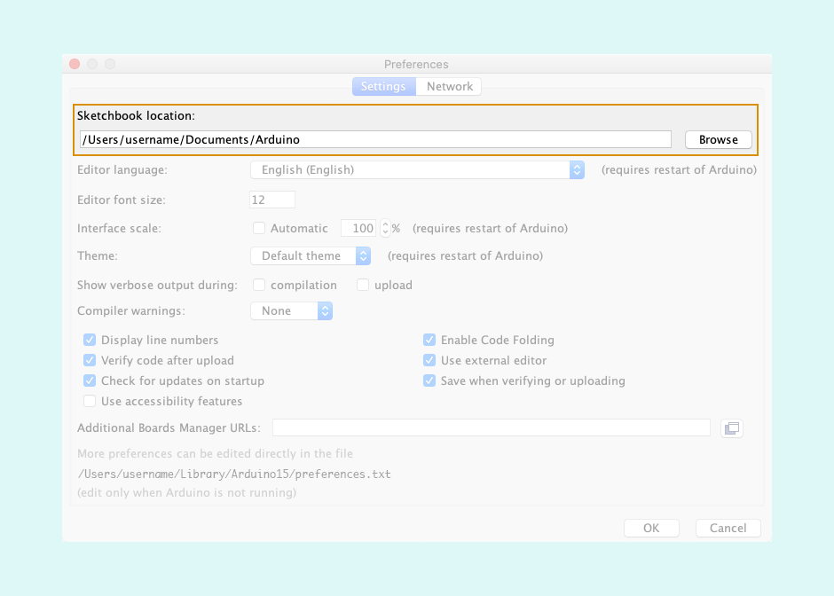
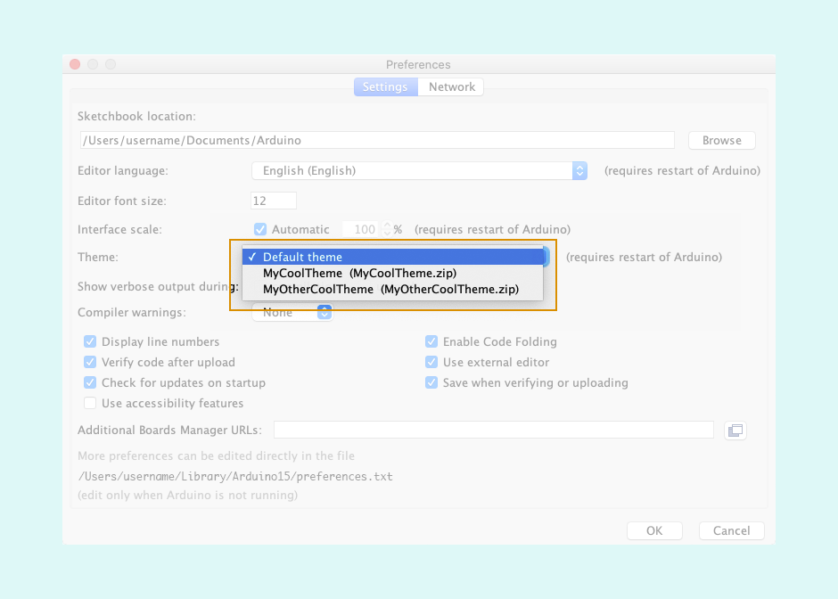

> Custom themes are currently not supported for Arduino IDE 2.

Learn how to install a .zip packaged theme for Arduino IDE 1.

---

1. Open the Sketchbook folder. By default it is located in:
   * Windows: `C:\Users\{username}\Documents\Arduino`
   * macOS: `~/Documents/Arduino`
   * Linux: `~/Arduino`

   You can check the location in Preferences, under _Sketchbook location_:

   * Windows/Linux: **File > Preferences**
   * macOS: **Arduino > Preferences**, or **Arduino > Settings** depending on your macOS version.

   

2. If open, close Arduino IDE.

3. In the sketchbook folder, create a subfolder named `theme`.

4. Drag and drop the custom theme .zip file into the `theme` subfolder you created.

   > Note: The custom theme must be in the root of the .zip file, **NOT** in a subfolder.

   * The folder structure should look as follows:

     ```
     <Sketchbook folder>
     |_ theme
        |_ MyCoolTheme.zip
           |_ syntax
           |   |_ etc...
           |_ theme.txt
           |_ etc...
     ```

   * Multiple themes can be installed by adding multiple .zip files and the folder structure should look as follows:

     ```
     <Sketchbook folder>
     |_ theme
        |_ MyCoolTheme.zip
        |  |_ syntax
        |  |   |_ etc...
        |  |_ theme.txt
        |  |_ etc...
        |_ MyOtherCoolTheme.zip
           |_ syntax
           |   |_ etc...
           |_ theme.txt
           |_ etc...
     ```

5. Open the Arduino IDE, select the theme from the Arduino IDE at **File > Preferences > Theme** menu.

   

6. Restart the Arduino IDE again.
