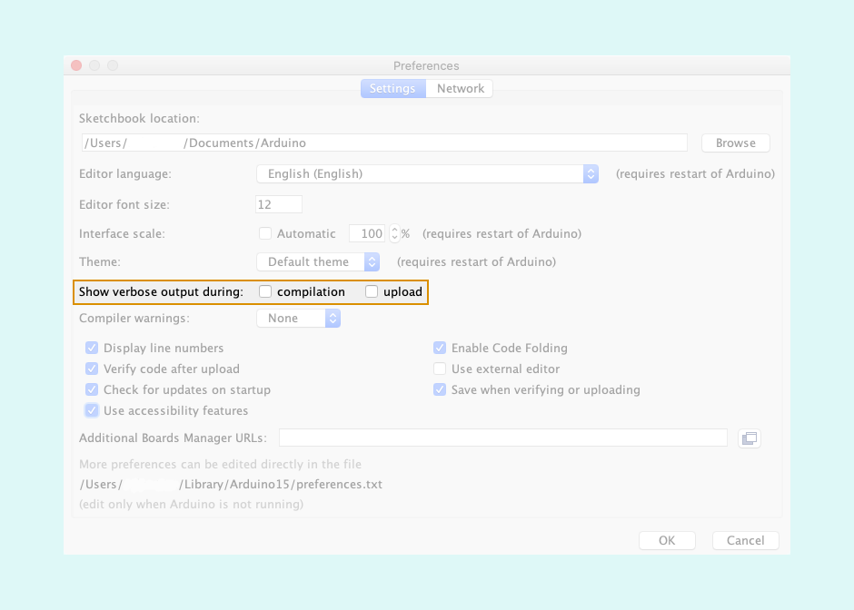
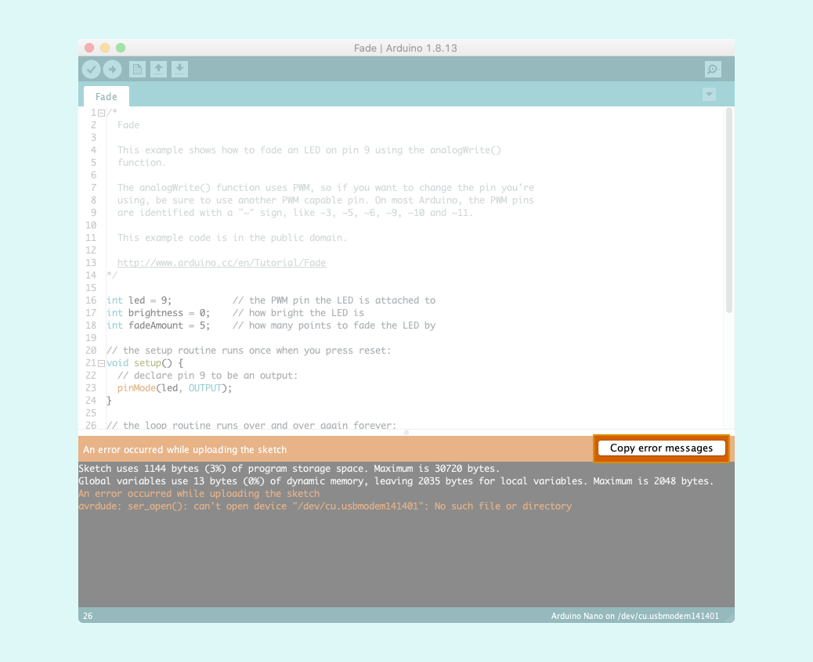

Enabling verbose output will output more detailed information in the console. This is useful for troubleshooting errors during compilation or upload.

## Enable verbose output

Verbose output is enabled in Preferences.

1. Open Preferences
   - Windows/Linux: **File > Preferences**
   - macOS: **Arduino IDE > Preferences**[^1]

   [^1]: If you're using Arduino IDE 2.1 or older, this option may be called **Arduino IDE > Settings**. ([#2022](https://github.com/arduino/arduino-ide/issues/2022))

2. For the verbose output setting, tick **compilation**, **upload**, or both.

## Copy error output

When the IDE throws an error, the output can be copied to your clipboard by clicking the _Copy error messages_ button. You can then paste the output in a document for saving, or share it via email or on the web.

## Further reading

- [Learn about upload errors](https://support.arduino.cc/hc/en-us/articles/4403365313810-Errors-when-uploading-a-sketch)
- [Using Arduino – Arduino Forum](https://forum.arduino.cc/c/using-arduino/6)
