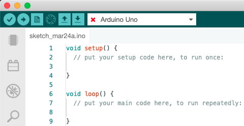
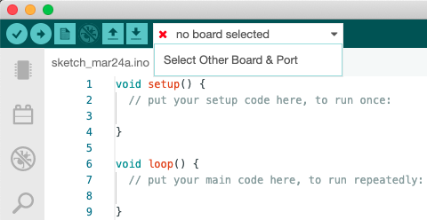
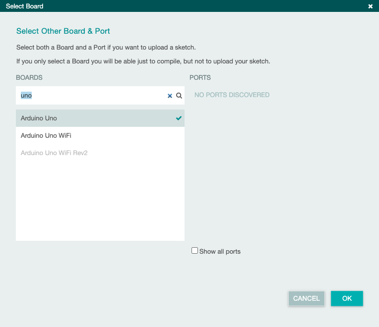

When compiling or uploading, the following error appears in the output panel.

```
Compilation error: Missing FQBN (Fully Qualified Board Name)
```

When compiling or uploading code, this error will occur if no board is selected, or if the board core is not installed.

Note that a board needs to be selected even if you're not uploading any code.

## Is a board selected?

Since the code cannot compile without a board selected, we'll start by ensuring just that.



It should be looking somewhat like the above. The name of your board should be visible in the board dropdown bar. There may also be a red cross. This indicates that the board isn't available on any port but this will not prevent the code from compiling.

If it reads `no board selected`, a board needs to be selected. Click to open the dropdown.



If you have a board plugged in, and you want to write code for that board, you can choose it in the dropdown. Otherwise, choose 'Select Other Board & Port'.



Choose the intended board. You do not have to select a port. Click 'OK'.

If you do not have the associated board core installed, you may receive the following pop-up.


In this case, choose 'Yes' to have the required core installed.

## Is the board core installed?

In the above example, we used the pop-up to install the required core. If you didn't receive a pop-up, or if you're receiving the same error despite a board being selected, please ensure the *board core* is installed using [this guide](https://www.arduino.cc/en/Tutorial/getting-started-with-ide-v2/ide-v2-board-manager#installing-a-core).
