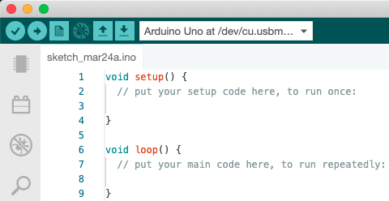
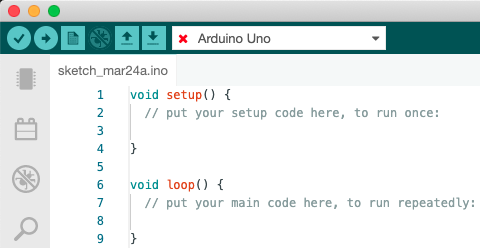
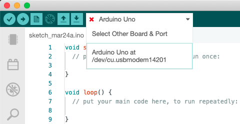

When uploading, the following error appears in the output panel.

```
Upload error: Error: 2 UNKNOWN: uploading error: no upload port provided
```

This error appears when trying to upload with no port selected. Please check the following:

## Do you have a board plugged in?

The board that you want to upload your code to needs to be plugged into a USB port using a data USB cable. If you just want to try compiling your code without uploading it, click the 'Verify' button (check mark symbol).

## Do you have a port selected?

The board dropdown in the top bar should display your selected port as `[board] at [port]`.



If it only has the board name, with a red check mark, you need to select a port.

## How to select a port



In the example above, the board 'Arduino Uno' has been selected. The same board is also plugged into a USB port. However, no port has been selected, which is indicated by the red cross. Let's open the board dropdown by clicking.



If you have a board plugged in, it should appear in the list. In our example, it's `Arduino Uno at /dev/cu.usbmodem14201`. Click to select the port.


With the port selected, you can try uploading the code.
