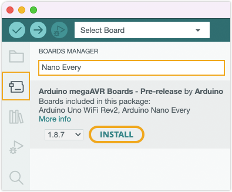

A **board core** (or just _board_ for short) is a collection of files needed to compile and upload sketches for a board. Cores are contained in _packages_ and can be installed using the Board Manager.

---

## Add a board with the Boards Manager

Official Arduino cores can be conveniently installed with the Boards Manager tool.

1. In the menu bar, select _Tools > Board > Boards Manager_. In IDE 2 you can also access it by clicking the button in the left-most sidebar.

2. Either search for the package name (e.g. "megaAVR"), or the board (e.g. "Uno", "MKR1000", or "Portenta"), by typing in the search field.

3. Find the package that includes your board.

4. Click **Install** (the latest version is selected by default).

   > If the package is already installed, you will instead have the option of installing a different version.

5. Wait for the installation to complete.

    

      <figure style="display: inline-block; margin: 0;">
          
          <figcaption><i>Boards Manager in Arduino IDE 1.x.</i></figcaption>
      </figure>
      <figure style="display: inline-block; margin: 0;">
          
          <figcaption style><i>Boards Manager in Arduino IDE 2.</i></figcaption>
      </figure>
    

You can now select boards from the installed packages in the _Tools > Board_ menu:

---

## Add additional packages to the Boards Manager

See [Add or remove third-party boards in Boards Manager](https://support.arduino.cc/hc/en-us/articles/360016466340-Add-or-remove-third-party-boards-in-Boards-Manager).

---

## Install a board manually

Cores can also be added directly to the file system. See [Find sketches, libraries, board cores, and other files on your computer](https://support.arduino.cc/hc/en-us/articles/4415103213714-Find-sketches-libraries-board-cores-and-other-files-on-your-computer#boards).

---

## Further reading

* [Add or remove third-party boards in Boards Manager](https://support.arduino.cc/hc/en-us/articles/360016466340-Add-or-remove-third-party-boards-in-Boards-Manager)
* [Uninstall boards using the Boards Manager](https://support.arduino.cc/hc/en-us/articles/4407225360018-Uninstall-boards-using-the-Boards-Manager)
