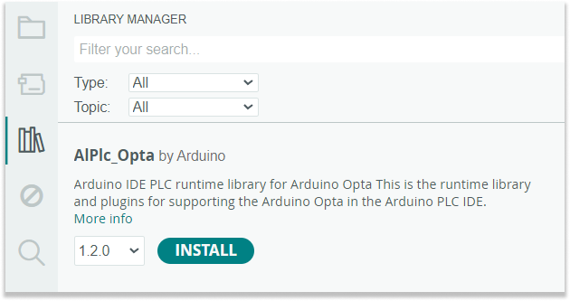

Libraries are a collection of code that provide extra functionality for use in sketches, for example when working with hardware or manipulating data.

In this article:

* [Using the Library manager](#library-manager)
* [Importing a .zip Library](#zip-library)
* [Manual installation](#manual-installation)
* [Using installed libraries](#using-libraries)

---

## Using the Library manager{#library-manager}

1. **Do one of the following:**

   * In the menu bar, select _Tools > Manage Libraries..._
   * In IDE 2, you can also click on the  button in the sidebar.

2. Filter the available libraries by typing something (such as a library name) in the text field above the listed libraries.

3. Find the library in the search results. The results are listed alphabetically, so you may need to scroll down the list.

4. Find a library you want to install. You can review the description and author. When you've found a library you want to install, click **Install**. The latest version is selected by default.

   

5. Wait for the installation to complete.

> [!NOTE]
> To find more information about the library, click **More info**. This will usually take you to a reference page or repository for the library

---

## Importing a .zip Library{zip-library}

1. In the menu bar, go to *Sketch > Include Library > Add .ZIP Library...*

2. You will be prompted to select the library you want to add. Navigate to the .zip file's location and open it.

---

## Manual installation{manual-installation}

1. Go to the directory where you have downloaded the .zip library file.

2. Extract the .zip file.

3. Select the main folder (it should have the library's name) and move it to the "libraries" folder [inside your sketchbook](https://support.arduino.cc/hc/en-us/articles/4412950938514-Open-the-Sketchbook).

4. Restart Arduino IDE.

> [!NOTE]
> Adding a library to the "libraries" folder in the sketchbook will override other previously installed library versions.

---

## Using installed libraries {#using-libraries}

When the library has been installed you can do the following:

* Open any included example sketches from _File > Examples > \<Library Name\>_ in the top menu bar. Note that all libraries do not come with examples.
* Include the library in your sketch by selecting _Sketch > Include Library > \<Library Name\>_.

---

## Further reading

* [Uninstall a library from Arduino IDE](https://support.arduino.cc/hc/en-us/articles/360016077340-Uninstall-a-library-from-Arduino-IDE)

* [Installing libraries in the Arduino IDE 2](https://docs.arduino.cc/software/ide-v2/tutorials/ide-v2-installing-a-library) on Arduino Docs

* About [#include](https://www.arduino.cc/reference/en/language/structure/further-syntax/include/)
