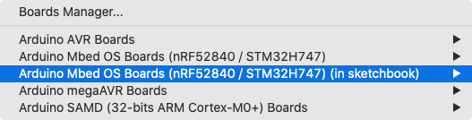

The IDE allows for multiple versions of the same core to be installed simultaneously. This can be useful for testing purposes, or for solving compatibility issues with a specific core version.

In this guide, we'll create the appropriate folder structure and install a core.

## 1. Creating the folder structure

> [!NOTE]
> You can skip this step if you already have a folder.

In the commands below, `<sketchbook>` refers to the location of your sketchbook folder. It is typically located in the `Arduino` subfolder of your Documents folder, but you can find the location in the IDE preferences under `Sketchbook location`.

The preferred folder structure is

```
<sketchbook>/hardware/<vendor>/<architecture>/
```

We recommend you follow this naming convention as this will ensure proper determination of library compatibility and permit referencing resources from other cores of the same architecture.

For Arduino cores, the `<architecture>` name may correspond to the `x` in `ArduinoCore-x`. Consulting relevant documentation is recommended, however.

---

Follow these steps to create the appropriate folder structure.

1. Open the sketchbook folder.
2. In the sketchbook folder, create a folder called `hardware`. Open it.
3. Inside the `hardware` folder, create the `<vendor>` folder. This can have any arbitrary unique vendor name, e.g. `arduino` or `arduino-git`.

## 2. Installing the core

The core can be downloaded with a web browser or by cloning the git repo.

### Using your web browser

1. Download the git repo. In GitHub this is done by clicking `Code > Download ZIP`.
2. Extract the core into `<sketchbook>/hardware/<vendor>/<architecture>`.

### Using git

Simply navigate into `<sketchbook>/hardware/<vendor>` and clone the repo into a folder named `<architecture>`.

```
cd <sketchbook>/hardware/<vendor>
git clone <repo URL> <architecture>
```

If we wanted to clone [arduino/ArduinoCore-avr](https://github.com/arduino/ArduinoCore-avr) into the vendor folder `arduino`, we'd use the following command.

```
cd <sketchbook>/hardware/arduino
git clone https://github.com/arduino/ArduinoCore-avr avr
```

Often the bugfix may not be on the main branch. After cloning the repo, we can switch branches with the following command.

```
git checkout <bugfix-branch>
```

## 3. Installing the ArduinoCore-API

The Mbed OS, SAMD, and megaAVR boards platforms (as well as AVR in the near future and any new platforms that are created) use [ArduinoCore-API](https://github.com/arduino/ArduinoCore-API), which contains all the non-architecture specific code that can be shared between all core libraries. This must be installed in addition to the board platform.

### Installing the ArduinoCore-API

> [!NOTE]
> You can skip this step if you already have the ArduinoCore-API installed, or if it's not needed by your platform.

Download and extract the API, or clone it, into a directory of your choice.

```
git clone git@github.com:arduino/ArduinoCore-API
```

### Symlink the ArduinoCore-API

**On macOS/Linux (using Terminal):**

```
ln -s "<ArduinoCore-API_path>/api" "<core_path>/cores/arduino/api"
```

**On Windows (using cmd.exe):**

```
mklink /D "<core_path>\cores\arduino\api" "<ArduinoCore-API_path>\api"
```

## 4. Using the core

Restart the IDE if open. The new core will now be available in `Tools > Board > [core_name] (in sketchbook)`.


