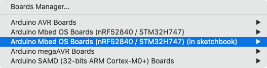

The IDE allows for multiple versions of the same core to be installed simultaneously. This can be useful for testing purposes, or for solving compatibility issues with a specific core version.

In this guide, we'll create the appropriate folder structure and install a core.

## 1. Creating the folder structure

> [!NOTE]
> You can skip this step if you already have the correct folder structure created.

In this guide, `<sketchbook>` refers to the location of your sketchbook folder. 

### Finding your sketchbook location

If you're not sure where your sketchbook is, follow these steps:
1. Open the Arduino IDE.
2. Open the Preferences/Settings:
   - **On Windows/Linux:** Go to **File > Preferences**.
   - **On macOS:** Go to **Arduino IDE > Settings** (or **Preferences**).
3. Find the path listed under the **Sketchbook location** field.

By default, the sketchbook folder is located here:
- **Windows:** `C:\Users\<username>\Documents\Arduino`
- **macOS:** `/Users/<username>/Documents/Arduino`
- **Linux:** `/home/<username>/Arduino`

### Designing the folder structure

To ensure proper library compatibility and resource loading, custom cores must be installed in a specific nested folder structure inside your sketchbook:

```text
<sketchbook>/hardware/<vendor>/<architecture>/
```

- **`<vendor>`**: Any arbitrary, unique folder name representing the creator or source (e.g., `arduino` or `arduino-git`).
- **`<architecture>`**: The target board architecture (e.g., `avr`, `samd`, `mbed`, or `esp32`). For Arduino cores, this typically matches the `x` in `ArduinoCore-x`.

For example, a custom AVR core under the `arduino` vendor would look like:
```text
Arduino/hardware/arduino/avr/
```

### Step-by-step folder creation

Follow these steps to create the appropriate folders:

1. Navigate to your **sketchbook folder**.
2. Create a folder named `hardware` (if it does not exist) and open it.
3. Inside `hardware`, create a folder for your `<vendor>` (e.g., `arduino`) and open it.
4. Inside your `<vendor>` folder, create a folder for your `<architecture>` (e.g., `avr`).

---

## 2. Installing the core

The core can be downloaded with a web browser or by cloning the git repo.

### Using your web browser

1. Download the repository from GitHub by clicking the **Code** button and selecting **Download ZIP**.
2. Extract the ZIP file contents directly into the `<sketchbook>/hardware/<vendor>/<architecture>` folder.

> [!IMPORTANT]
> When extracting the ZIP, make sure that the core files (such as `boards.txt`, `platform.txt`, etc.) are located directly inside your `<architecture>` folder (e.g., `avr/`). If they are nested inside an extra subfolder created by the ZIP extractor (like `ArduinoCore-avr-master/`), move them up into the `<architecture>` folder.

### Using git

Simply navigate into `<sketchbook>/hardware/<vendor>` and clone the repo into a folder named `<architecture>`.

```bash
cd <sketchbook>/hardware/<vendor>
git clone <repo URL> <architecture>
```

If we wanted to clone [arduino/ArduinoCore-avr](https://github.com/arduino/ArduinoCore-avr) into the vendor folder `arduino`, we'd use the following command.

```bash
cd <sketchbook>/hardware/arduino
git clone https://github.com/arduino/ArduinoCore-avr avr
```

Often the bugfix may not be on the main branch. After cloning the repo, we can switch branches with the following command:

```bash
git checkout <bugfix-branch>
```

---

## 3. Installing the ArduinoCore-API

The Mbed OS, SAMD, and megaAVR boards platforms (as well as AVR in the near future and any new platforms that are created) use [ArduinoCore-API](https://github.com/arduino/ArduinoCore-API), which contains all the non-architecture specific code that can be shared between all core libraries. This must be installed in addition to the board platform.

### Installing the ArduinoCore-API

> [!NOTE]
> You can skip this step if you already have the ArduinoCore-API installed, or if it's not needed by your platform.

Download and extract the API, or clone it, into a directory of your choice.

```bash
git clone git@github.com:arduino/ArduinoCore-API
```

### Symlink the ArduinoCore-API

**On macOS/Linux (using Terminal):**

```bash
ln -s "<ArduinoCore-API_path>/api" "<core_path>/cores/arduino/api"
```

**On Windows (using cmd.exe):**

```cmd
mklink /D "<core_path>\cores\arduino\api" "<ArduinoCore-API_path>\api"
```

---

## 4. Using the core

If the Arduino IDE is open, **you must restart it** to load and register the newly installed custom core.

Once the IDE restarts, the new core and its associated boards will be available in the board selector:
- **Arduino IDE 2.x:** Select your board from the board dropdown or go to **Tools > Board**. The custom core boards will appear grouped under a category indicating they are located in the sketchbook.
- **Arduino IDE 1.x:** Go to **Tools > Board > [core_name] (in sketchbook)**.

