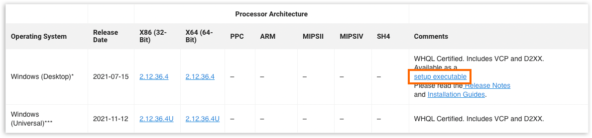
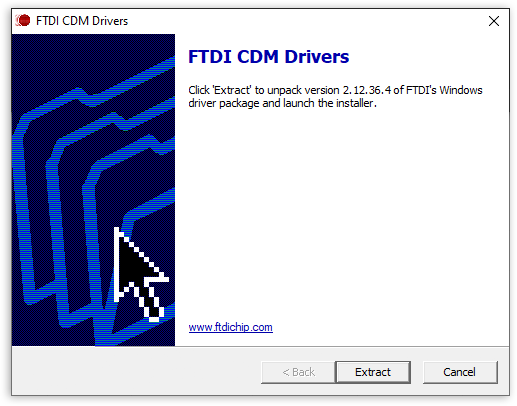
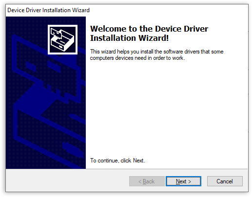
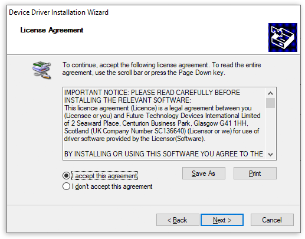
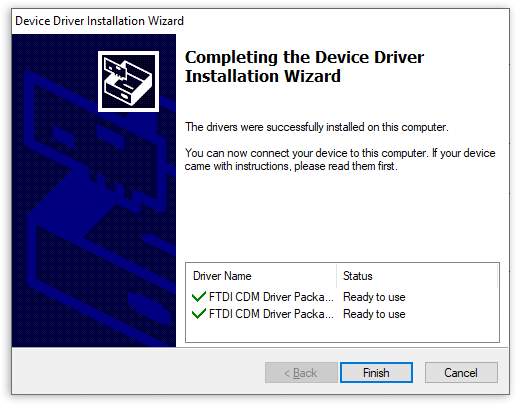
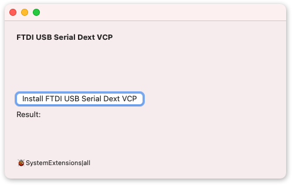
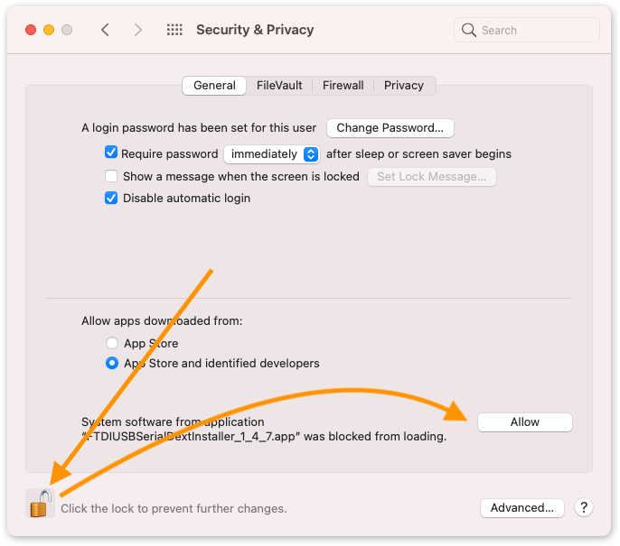
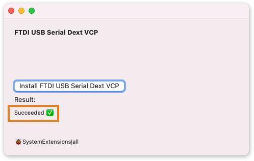

Often FTDI drivers will be automatically installed by your system when using Arduino. But if this does not happen, or if you believe the drivers are outdated or corrupted, you can follow the instructions below.

---

## Windows

1. Go to the [FTDI Chip driver page](https://ftdichip.com/drivers/vcp-drivers/).

2. Scroll down and find the VCP driver downloads.

3. Download the **setup executable** for _Windows (Desktop)_.

   

4. Run the executable.

5. In the window that opens, click 'Extract'.

   

6. Click 'Next'.

   

7. Accept the license agreement and click Next to proceed.

   

8. When the installation is complete, click Finish to close the window.

   

---

## macOS

1. Go to the [FTDI Chip driver page](https://ftdichip.com/drivers/vcp-drivers/).

2. Scroll down and find the VCP driver downloads.

3. Download the latest release applicable for your system.

   > To check your OS version, click 'Apple > About this Mac' in the menu bar.

4. Extract the downloaded archive.

5. Move the `.app` file into the Applications folder.

   

6. Open the app and click 'Install FTDI USB Serial Dext VCP'.

   

   **If you are asked to set security permissions to allow the installation, proceed with steps 7 and 8**. Otherwise, skip to step 9.

7. Click the button to open Settings or press `CMD + Space` to open Spotlight and start typing 'Security & Privacy' until that option appears.

8. Click the lock and enter your password, then click 'Allow'.

   

9. When the installation is completed the result will say "Succeeded".

   

   You can now close the window.

---

## Linux

Manual installation is not necessary, all FTDI devices are now supported in Ubuntu 11.10, kernel 3.0.0-19.

---

## Further reading

* [Installation Guides (FTDI Chip)](https://ftdichip.com/document/installation-guides/)
