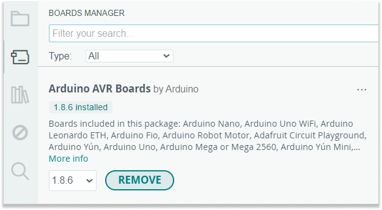

The Boards Manager provides the most convenient way to remove unwanted or unused boards. The location of the installed cores can be found [here](https://support.arduino.cc/hc/en-us/articles/4415103213714#boards).

The following instructions to uninstall is not limited to the core in this example; it equally would be applicable to both official Arduino and third party cores.

In this article:

- [Uninstall using the Boards Manager](#uninstall_board)
- [Uninstall by directly deleting files](#delete_files)

---

## Uninstall using the Boards Manager{#uninstall_board}

The Boards Manager provides the most convenient way to remove unwanted or unused boards.

1. In the menu bar, select *Tools > Board > Boards Manager...* or you can also click on the  button in the sidebar.

2. Filter the results by typing in the text field, and find the board package you want to uninstall.

3. Click the **Remove** button.

   

4. Confirm that you want to uninstall the library by clicking **Yes**.

5. Wait while Arduino IDE uninstalls the board package.

---

## Uninstall by directly deleting files{#delete_files}

The files can also be removed directly with your system's file manager application:

1. [Open the Arduino15 folder](https://support.arduino.cc/hc/en-us/articles/360018448279-Open-the-Arduino15-folder).

2. Open the `packages` subfolder.

3. Open the package vendor's subfolder, e.g. `arduino`, or `adafruit`.

4. Open the `hardware` subfolder. This folder contains the board packages.

5. Remove any/all folders within.

---

## Further reading

- [Add boards to Arduino IDE](https://support.arduino.cc/hc/en-us/articles/360016119519)
