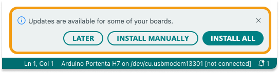
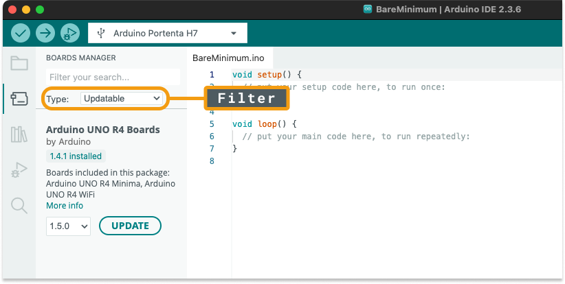
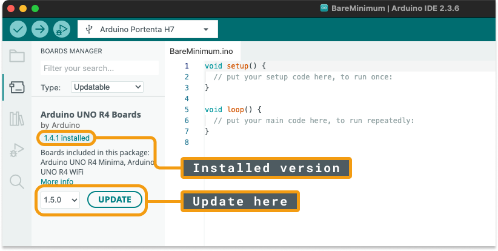

Updating your board packages ensures compatibility with the latest features and improves performance and stability. Learn how to update board packages in Arduino IDE.

In this article:

<!-- TOC -->

- [Update using the "Updates are available" prompt](#update-using-the-updates-are-available-prompt)
- [Update boards using the Board Manager](#update-boards-using-the-board-manager)

<!-- /TOC -->

---

## Update using the "Updates are available" prompt

Arduino IDE automatically checks for board package updates each time you start the application.

If an update is available, a notification will be displayed in the corner with these options:

- _Later._ Close the prompt without updating.
- _Install Manually._ View updatable board packages in the Board Manager.
- _Install All._ Install all updates automatically.

You can also manually trigger the "Updates are available" prompt:

1. Use one of these keyboard shortcuts to open the Command Palette:

   - Press `Ctrl`+ `Shift` + `P` (Windows/Linux) / `⌘` + `Shift` + `P` (macOS)

   - Press `F1`.

2. Type "Update", and select **Check for Arduino Updates** (this command also checks for library updates).

3. If any of your installed board packages can be updated, the "Updates are available" prompt will appear.

## Update boards using the Board Manager

Follow these steps to update board packages in the Board Manager:

1. Open the  **Board Manager** from the sidebar, or select Tools > Board > Boards Manager in the menu bar.

2. Set the **Type** filter to "Updatable" to view board packages that can be updated. <!-- You can also search for any board by typing in the text field. -->

   

3. The currently installed version for each board package is displayed under the board name.

   Confirm the selected version to install (the latest is selected by default) and click **Update** to install it.

   

4. The installation is complete when the message `Platform X installed` appears in the Output panel.
