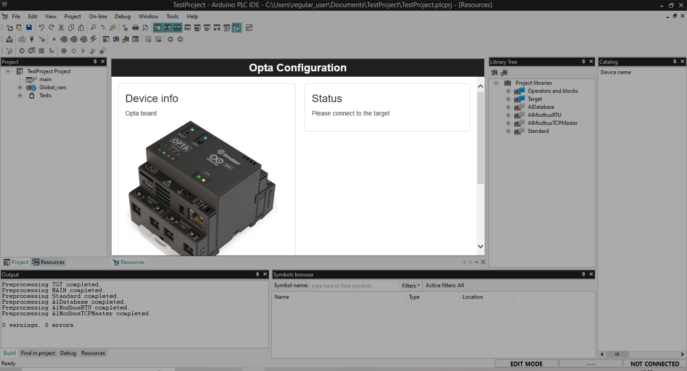
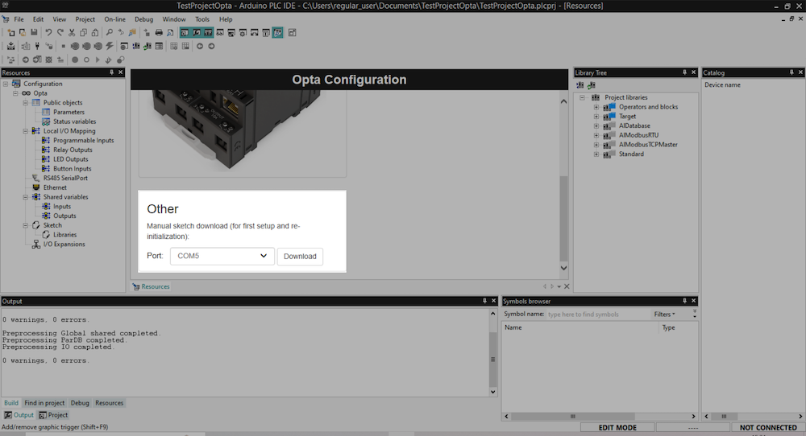

Learn how to find the serial port to use for your device in PLC IDE.

---

> [!IMPORTANT ]
> When the runtime has been installed, two serial ports may appear. When installing the runtime, the choice of port doesn't matter. When configuring the Modbus protocol, you should select the **lower-numbered** port as the target.

## Find serial ports in PLC IDE

1. Open a project.
1. Disconnect your PLC device from your computer.
1. Select **Project > Refresh current target** to refresh the list of ports.
1. Find the “DEVICE-NAME Configuration” panel for your device.

   

1. If necessary, scroll down inside the configuration panel until your see “Other” section.

   
1. Open the runtime sketch download port menu, and take note of the available ports.
1. Connect your PLC device to your computer.
1. Again, select **Project > Refresh current target** to refresh the list of ports.
1. Open the runtime sketch download port menu, and take note of any new ports.

## Find serial ports in Device Manager

1. Open the Device Manager.
1. Select **View > Devices by container**.
1. Look for an **Arduino Opta** or **Portenta H7 MCUboot** container.
1. Click to expand the container:

   

1. Look for **USB Serial Device** items, and note the port names.
