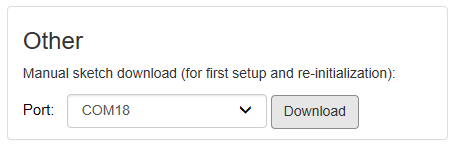

When multiple devices are connected to your computer, it's essential to identify which serial ports belong to your PLC device. Follow these steps to determine the correct port:

1. Disconnect your PLC device from your computer.
1. Select **Project > Refresh current target** to refresh the list of ports.
1. Open the runtime sketch download port menu, and take note of the available ports.

   

1. Connect your PLC device.
1. Again, select **Project > Refresh current target** to refresh the list of ports.
1. Open the runtime sketch download port menu, and take note of any new ports.

## Using Device Manager to Find Serial Ports

1. Open the Device Manager.
1. Select **View > Devices by container**.
1. Look for an **Arduino Opta** or **Portenta H7 MCUboot** container.
1. Click to expand the container:

   

1. Look for **USB Serial Device** items, and note the port names.
