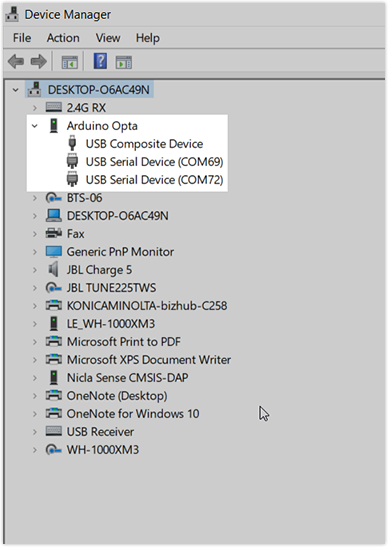

## Check this first

* If you haven't done so, start by checking the [Arduino PLC IDE Setup and Board's License Activation](https://docs.arduino.cc/software/plc-ide/tutorials/plc-ide-setup-license#instructions) tutorial.
* Make sure you've installed the **Arduino PLC IDE Tools** package, in addition to the main PLC application.
* When downloading the runtime, or connecting to the device, make sure you're [targeting the correct port](#about-ports).
* When opening a project created with an earlier version of the PLC IDE, some issues may occur. Try creating a new project (**File > New Project**) to see if this resolve the issue.
* You need **valid license** to download code to the device:
  * Licenses for Portenta Machine Control are [available in the store](https://store.arduino.cc/products/plc-key-portenta-machine-control). Instructions for license activation [are available here](https://docs.arduino.cc/software/plc-ide/tutorials/plc-ide-setup-license#6-license-activation-with-product-key-portenta-machine-control).
  * Arduino Opta is a pre-licensed product, just follow the [activation instructions](https://docs.arduino.cc/software/plc-ide/tutorials/plc-ide-setup-license#7-license-activation-with-pre-licensed-products-opta).

---

<a id="about-ports"></a>

## About port selection

It's important to understand which ports to target when configuring your PLC device connection.

### List of ports

#### Physical serial port (default)

Initially, only this port will be available. Target this port when [downloading the runtime](https://docs.arduino.cc/software/plc-ide/tutorials/plc-ide-setup-license#4-download-the-runtime).

#### Virtual serial port (created by runtime)

When the runtime has been downloaded to your device, an additional (virtual) port will appear. Because the virtual port is created after the serial port, it will usually have a **higher port number**. Target this port when [configuring the Modbus communication](https://docs.arduino.cc/software/plc-ide/tutorials/plc-ide-setup-license#5-connect-to-the-device).

### How to identify which ports belong to your device

If other devices connected to your computer have open serial ports, you need to determine which ports belong to your PLC device:

1. Disconnect your PLC device from your computer.
1. Select **Project > Refresh current target** to refresh the list of ports.
1. Open the runtime sketch download port menu, and take note of the available ports.

   

1. Connect your PLC device.
1. Again, select **Project > Refresh current target** to refresh the list of ports.
1. Open the runtime sketch download port menu, and take note of any new ports.

You can also use the **Device Manger** in Windows:

1. Open the Device Manager.
1. Select **View > Devices by container**.
1. Look for an **Arduino Opta** or **Portenta H7 MCUboot** container.
1. Click to expand the container:

   

1. Look for **USB Serial Device** items, and note the port names.

---

## Solutions for specific problems

### If the "On-Line > Set up communications" and "On-line > Connect" options are disabled

These options are only available when a project is open. Select **File > New Project** to create a new project.

### Error: “Unable to start the communication”

When choosing **On-line > Set up communications** you may get this error message:

```
Unable to start the communication
Choose 'On-line / Set up communication' to configure it
```

Resolve the issue by selecting **On-line > Set up communication** and checking the settings. See [Connect to the Device](https://docs.arduino.cc/software/plc-ide/tutorials/plc-ide-setup-license#5-connect-to-the-device) for help.

### Error: Cannot download sketch file (error code: 1)

When downloading the runtime sketch, you may get this error:

```
Cannot download sketch file (error code: 1)
```

Follow these steps:

1. Double-tap the reset button on the device to set it to **bootloader mode**, and try downloading the sketch again.
2. Close any applications that may be blocking the port, such as the serial monitor in Arduino IDE.
3. [Check the port selection](#about-ports).

### If nothing happens when downloading the runtime sketch

1. Ensure you've installed the **Arduino PLC IDE Tools** from the [Arduino Software page](https://www.arduino.cc/en/software#arduino-plc-ide).
2. Restart PLC IDE.

### Error: "(DownloadSketch) Can not download sketch: COM port must be used!"

When downloading the runtime sketch, this error may appear in the console:

```
(DownloadSketch) Can not download sketch: COM port must be used!
```

It can occur if the wrong port is selected in the manual sketch download widget. If you're unsure which port to use, see [About ports in PLC IDE](#about-ports).
<!-- markdownlint-disable-file HC001 -->
