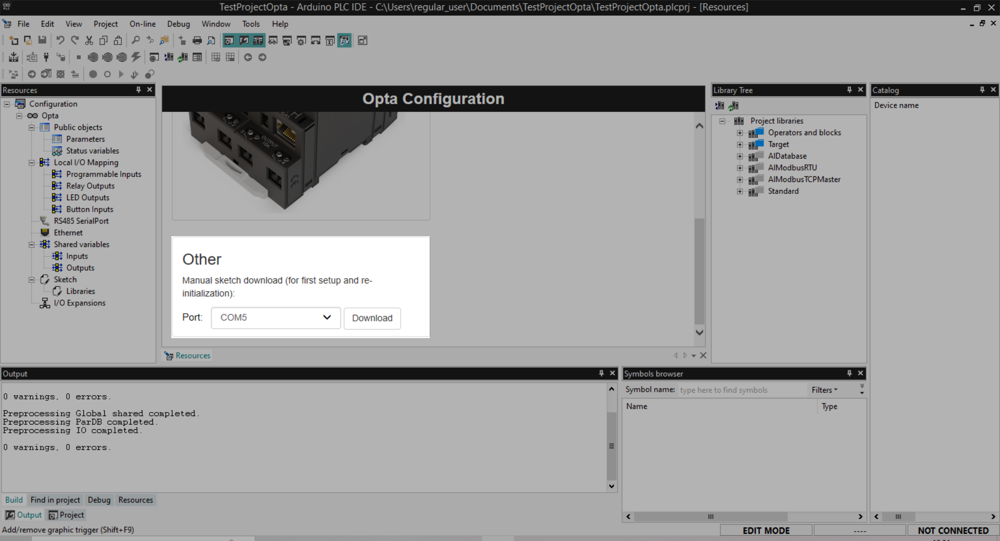

The **PLC runtime** runs on your PLC device and enables the Arduino PLC IDE to communicate with it. Learn how to install the PLC runtime on your device.

---

> [!TIP]
> Arduino PLC IDE lists only the COM port number for each connected device. Disconnect any unused USB devices and restart Arduino PLC IDE to make it easier to select the right port.

Follow these steps:

1. Create or open a project in PLC IDE.

1. Find the **Device configuration** panel:

   

1. If necessary, scroll down inside the configuration panel until you see the “**Other**” section:

   

1. Select the serial port for your device.

   - If mulitple ports are available, try the one with the lower COM port number first.

   - If you need help, see [Identify the serial ports of your PLC device](https://support.arduino.cc/hc/en-us/articles/16724283965596-Identify-the-serial-ports-of-your-PLC-device).

1. Click the **Download** button.

1. The runtime will be compiled and uploaded to the target device.

1. The process is complete when a line like this appears in the Resources tab of the **Output** panel:

   ```
   C:\Users\regular_user\Documents\TestProjectOpta\LLSketch\LLSketch.ino: sketch file downloaded
   ```
