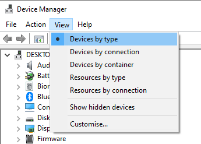
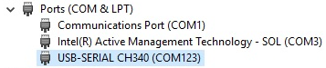

"`can't set com-state for ...`" error can occur when uploading to the boards that use specific batches of the [WCH CH340 USB chip](http://www.wch-ic.com/products/CH340.html). The problem only occurs when using the latest version of the CH340 driver.

Doing a "rollback" to an older version of the driver is a possible workaround.

## Download the older version of the driver

1. Download [this](https://www.wch-ic.com/downloads/file/65.html?time=2023-03-16%2022:57:59) and run it.

1. A **User Account Control** dialog may now appear. Click the `Yes` button.

1. A **DriverSetup(X64)** dialog will appear. Click the `Install` button.

1. Close **DriverSetup(X64)** and **Arduino IDE** if it is running.

## Roll back driver

1. Connect the Arduino board to your computer with a USB cable.

1. Connect the Arduino board to your computer with a USB cable.

1. Open **Device Manager**.

1. Select *View* > *Devices By Type* in the menu.

    

    Make sure *Show Hidden Devices* is not selected.

1. Open the `Ports (COM & LPT)` section. You should see a port identified as `USB-SERIAL CH340 (COM_n_)`

    

    Right-click on it and select **Properties**.

1. Select the `Driver` tab.

1. Click the `Roll Back Driver` button.

    If it is not clickable, you might have to follow these instructions [here](#roll-back-button).

1. Now that the **Driver Package rollback** dialog is open, Click the radio button next to **My apps don't work with this driver** and press the `Yes` button

1. Now start **Arduino IDE** and try to upload the sketch again.

## Roll back driver button not clickable {#roll-back-button}

1. Click the `Update driver` button.

1. An **Update Drivers Device - USB-SERIAL CH340 (COMn)** dialog will open.

1. Click on "Search automatically for drivers" in the "Update Drivers Device - USB-SERIAL CH340 (COMn)" dialog.
You should now see the driver installation wizard update the driver.

    If you get the message "**The best drivers are already installed**", follow [these steps](#reinstall)

1. Click the "Close" button in the "Update Drivers Device - USB-SERIAL CH340 (COMn)" dialog once the installation is finished.

## Re-installing device {#reinstall}

1. Right-click on **USB-SERIAL CH340 (COMn)** and select `Uninstall Device`.

1. Check the box next to "**Attempt to remove the driver for this device**" and click the `Uninstall` button.

1. Disconnect and reconnect the Arduino board.

1. Wait for the device to reappear in the `Ports (COM & LPT)` section. It might take a few seconds.

1. Now follow all the steps from the beginning again.
