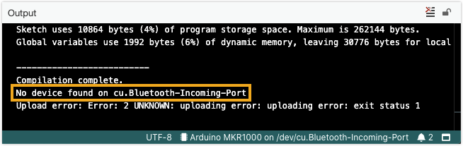

**Exit status 1** only indicates that a process has failed, it does not tell us anything specific about the problem.

## Check the error output for more information

Look for more specific errors in the console output. Typically these are output before (above) the exit status message. By searching for the error message in this [Help Center](https://support.arduino.cc/hc/en-us) or in the [Arduino Forum](https://forum.arduino.cc/) you can find more information on the issue.

In the below example, the output ends with an `exit status 1` error. The line above is more helpful, which tells us that no device (board) was found on the selected port. Most likely the wrong port is selected in _Tools > Port_.

## Find troubleshooting instructions

First, determine if the error occurs during compilation or upload:

* `Upload error: Error: 2 UNKNOWN: uploading error: uploading error: exit status 1`. This message indicates an **upload error**.
* `Compilation error: Error: 2 UNKNOWN: exit status 1`. This message indicates a **compilation error**.
* If it only reads `exit status 1`, or if you are unsure, you can check where the process fails by clicking the  **Verify** button. This compiles the sketch **without** trying to upload it to the board.
  * If you still get an error, it occurs during **compilation**.
  * If this passes with a `Compilation complete` message, the error occurs during **upload**.

You can now proceed with the instructions for your error type:

* For **upload errors**, see [Errors when uploading a sketch](https://support.arduino.cc/hc/en-us/articles/4403365313810-Errors-when-uploading-a-sketch).
* For **compilation errors**, see [Compilation errors when uploading](https://support.arduino.cc/hc/en-us/articles/4402764401554-Compilation-errors-when-uploading).
