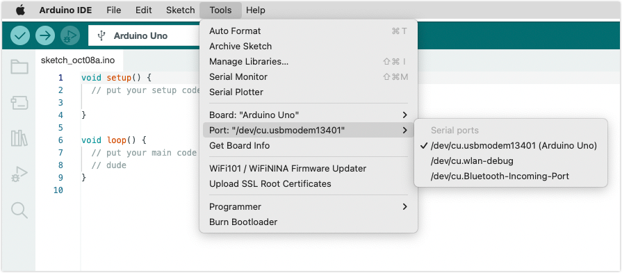

When uploading, you may see this error:

```
Failed uploading: no upload port provided
```

The error will occur if no **port** has been a selected.

Use one of these methods to select a port:

* In the top menu bar: Open _Tools > Port_ and click to select a port.

  

* With the board selector menu (IDE 2): Click to open, then select one of the options to configure board and port selection.

  

  When a board and port has been selected, this icon will be displayed:

  

It's useful to understand the difference between board and port selections:

* The **board** selection tells Arduino IDE how to compile the sketch and what protocols to use when uploading the sketch. In some cases, it will be automatically set, but it can be overridden with the _Tools > Board_ menu or in the "Select other board and port..." dialog.
* The **port** selection refers to an actual board (or other device) that's connected to your computer. Many boards are automatically recognized by Arduino IDE—these boards will have their name displayed next to their port in the _Tools > Port_ menu and will have its port associated with the identified board in the board selector menu.

## Further reading

* [Select board and port in Arduino IDE](https://support.arduino.cc/hc/en-us/articles/4406856349970-Select-board-and-port-in-Arduino-IDE)
* [If your board does not appear in the port menu](https://support.arduino.cc/hc/en-us/articles/4412955149586-If-your-board-does-not-appear-in-the-port-menu)
