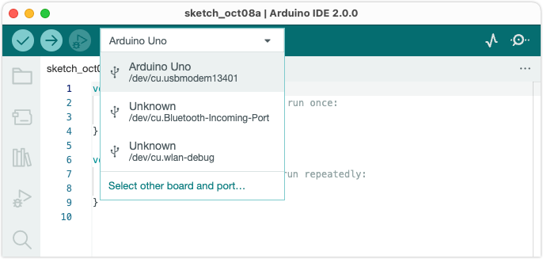

When uploading, you may see this error:

```
Failed uploading: no upload port provided
```

The error will occur if no **port** has been selected.

## Select a port

Use one of these methods to select a port:

* If you're using Arduino IDE 2, click the **board selector**, then select one of the options to configure the board and port selection.

  

  When a board and port has been selected, this icon will be displayed:

  

* Alternatively, manually select the port with the **Tools > Port** menu bar option.

  > **Note:** In IDE 2, the Tools > Port menu will only display if at least one port was detected. If it's missing, see [If your board is not detected by Arduino IDE](https://support.arduino.cc/hc/en-us/articles/4412955149586-If-your-board-does-not-appear-in-the-port-menu).

---

## Troubleshooting

If Arduino IDE doesn't detect your board on a port, or if the **Tools > Port** menu is missing, see [If your board is not detected by Arduino IDE](https://support.arduino.cc/hc/en-us/articles/4412955149586-If-your-board-does-not-appear-in-the-port-menu).

---

## About port and board selection

It's useful to understand the difference between board and port selection:

* The **board** selection tells Arduino IDE how to compile the sketch and what protocols to use when uploading the sketch. In some cases, it will be automatically set, but it can be overridden with the _Tools > Board_ menu or in the "Select other board and port..." dialog.
* The **port** selection refers to an actual board (or other device) that's connected to your computer. Many boards are automatically recognized by Arduino IDE—these boards will have their name displayed next to their port in the _Tools > Port_ menu and will have their port associated with the identified board in the board selector menu.
