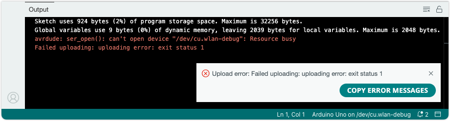

When an upload error occurs during sketch upload, you may see the error message `Failed uploading: uploading error: exit status 1` in the console. In Arduino IDE, the message may only be displayed in a pop-up notification in the bottom-right corner. In the console, it is typically printed last in the output, and simply indicates that the upload process has failed.

---

## Try this first

Most upload problems can be resolved by doing the following:

* **Check your connections**. Your board needs to be connected with a data USB cable (charge-only cables will not work). Make sure the cable is fully inserted in the port on each end. Try a different USB cable, and avoid hubs and other adapters if possible. Remove connections to the board pins, especially the **0 (RX)** and **1 (TX)** digital pins.

* **Check your board and port selections**. Make sure the right board and port are selected, either in the board selector or the _Tools > Board_ and _Tools > Port_ menus.

  * If you can't find your board in the list, or if the _Tools > Port_ option is missing, see [If your board does not appear in the port menu](https://support.arduino.cc/hc/en-us/articles/4412955149586-If-your-board-does-not-appear-in-the-port-menu).

  * To learn more, see [Select the right port and board](https://support.arduino.cc/hc/en-us/articles/4406856349970-Select-board-and-port).

* **Make sure other applications aren't using the port**. Close other instances of the IDE, serial monitors, and any other applications that may be using the port.

  * See [Find and stop process blocking a port](https://support.arduino.cc/hc/en-us/articles/4407830972050-Find-and-stop-process-blocking-a-port) for more information.

* **If you're on Linux**, and are experiencing issues where the boards seems to disconnect mid-upload, you may need to [configure udev rules](https://support.arduino.cc/hc/en-us/articles/9004359328796).

For more troubleshooting tips, see [Errors when uploading a sketch](https://support.arduino.cc/hc/en-us/articles/4403365313810-Errors-when-uploading-a-sketch).

---

## Check the console output

The output console may contain information that does not appear in the pop-up notification:

* The console output may contain useful output from the **upload tool** used, such as avrdude or dfu-util, with more specific information about why the upload failed.
* You may get more detailed information by [enabling verbose output](https://support.arduino.cc/hc/en-us/articles/4407705216274-Use-verbose-output-in-the-Arduino-IDE) and attempting to upload the sketch again.

These are some errors that may  appear in the console output:

* If you're getting `avrdude: stk500_recv(): programmer is not responding` and `avrdude: stk500_getsync() attempt x of 10: not in sync` errors, [follow these instructions](https://support.arduino.cc/hc/en-us/articles/4401874331410--Error-avrdude-when-uploading#avrdude-stk500_recv-and-stk500_getsync).
* If you're getting `avrdude: ser_open(): can’t open device` errors, make sure you've selected the right port, and close any other applications that may be using the port.
* For other errors that start with `avrdude`, see ['Error: avrdude' when uploading](https://support.arduino.cc/hc/en-us/articles/4401874331410--Error-avrdude-when-uploading).
* For help with troubleshooting upload problems in general, see [Errors when uploading a sketch](https://support.arduino.cc/hc/en-us/articles/4403365313810-Errors-when-uploading-a-sketch).
