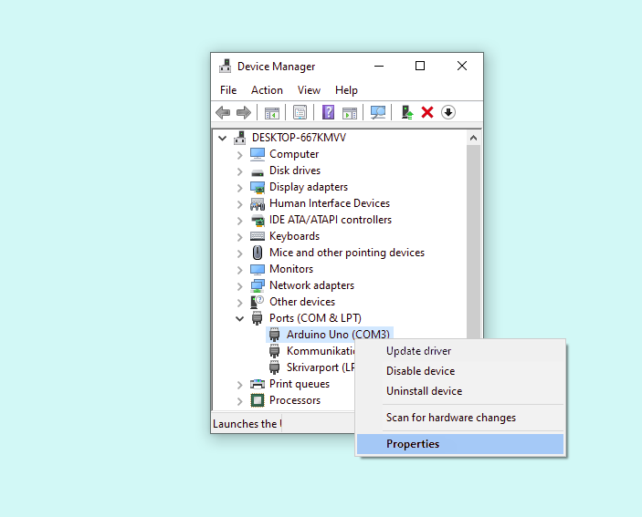
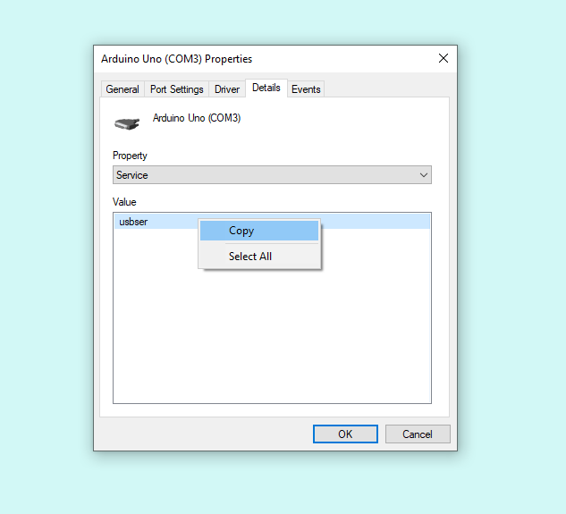
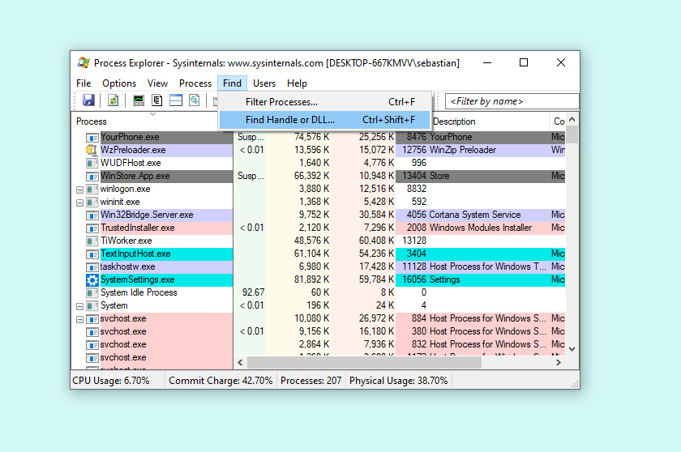
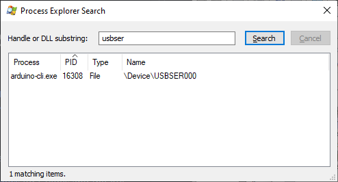
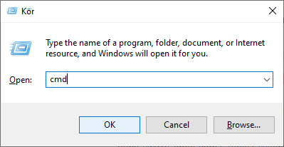

Learn how to find and stop a process blocking a port for your system.

In this article:

* [Windows](#windows)
* [macOS](#macOS)
* [Linux](#linux)

---

<a id="windows"></a>

## Windows

> **Note.** This method requires the <a class="link-external" href="https://learn.microsoft.com/en-us/sysinternals/downloads/process-explorer">Process Explorer tool from Microsoft</a>.

1. Identify the name of the port you are using in Arduino IDE by checking the **Tools > Port** menu. The port name will start with "COM", for example, `COM3`.

1. **Open the Device Manager.** This can be done by pressing <kbd>Win</kbd> + <kbd>X</kbd> on your keyboard to open the Power User menu and selecting **Device Manager**.

1. Expand the **Ports** section and find the device associated with the port you are using with Arduino IDE (the device may or may not show the board name). If you can't see the Ports section, make sure **View > Devices by type** is selected.

1. Right-click on the device with the matching port name, and select **Properties**.

   

1. Next, open the **Details** tab and select "Service" in the Property dropdown. Right-click the value displayed in the field below and click **Copy**.

   

1. Open the Process Explorer tool. If you don't have it, <a class="link-external" href="https://learn.microsoft.com/en-us/sysinternals/downloads/process-explorer">download and install it here</a>.

1. In Process Explorer, select **Find > Find Handle or DLL**.

   

1. Paste your copied value into the search field and click **Search**. The search should return the process using the port.

   

1. Look at the process name and see if it is an application that you recognize and can close.

1. If you're unable to stop the process this way, you can force it to close using the `taskkill` command. Note the processes's **PID** value from the search results, then press <kbd>Win</kbd> + <kbd>R</kbd> on your keyboard to open the Run window. Enter "cmd" and click **OK**. This will open the Command Prompt.

   

   In the Command Prompt, enter the following command, replacing `<PID>` with the name from the previous step.

   ```
   taskkill /pid <PID> /F
   ```

   When successful, it should return something like:

   ```
   SUCCESS: The process "arduino-cli.exe" with PID 15880 has been terminated.
   ```

1. Try uploading your sketch again. If this resolves the issue, and you already tried restarting your computer, the process that's blocking the port is probably being run on startup. <a class="link-external" href="https://support.microsoft.com/help/4026268">Learn how to configure startup apps here</a>.

---

<a id="macOS"></a>

## macOS

1. Identify the name of the port you're trying to access. The port name may appear in the error output, but you can also see it in the **Tools > Port** menu.

   It will usually start with `/dev/cu.usbmodem`, for example, `/dev/cu.usbmodem141401`.

2. **Open Terminal.** You can find it with Spotlight by pressing <kbd>⌘</kbd> + <kbd>Space</kbd> and typing "Terminal".

3. Input the following command, replacing `<port name>` with the port name for your board.

   ```
   lsof /dev/cu.usb*
   ```

   The output may look something like this:

   ```
   username@computer ~ % lsof /dev/cu.usbmodem2301
   COMMAND   PID              USER   FD   TYPE DEVICE SIZE/OFF NODE NAME
   Arduino 33341          username   82u   CHR    9,7      0t0 1057 /dev/cu.usbmodem2301
   ```

   The first value returned is the **process name**, which in this case was `Arduino`. This is because another instance of the IDE is running with the Serial Monitor open. The second value, in this case `19772`, is **the Process identifier (PID)**. We can get more info with this command (replace `<PID>` with the PID in your input):

4. To get more information about the process, use the `ps` command:

   ```
   ps <PID>
   ```

   In this case the resulting output was:

   ```
   username@computer ~ % ps 33341                 
     PID   TT  STAT      TIME COMMAND
   33341   ??  S      5:28.07 /Applications/Arduino.app/Contents/MacOS/Arduino
   ```

   > **Note:** In some cases, the parent process may be more informative.
   >
   > You can use this command: `ps -o ppid= <PID> | xargs ps`

5. Note the path under **COMMAND**. Using the process name or path may be able to find and close an application that's running the process. You can also try stopping the process in the Activity Monitor (again, you can use `CMD + Space` and search for 'Activity Monitor'). If you can't locate the source of the processs, you can terminate the process using the `kill` command.

   Type the following in Terminal:

   ```
   kill <PID>
   ```

   If the process still doesn't stop, you can use add the `-9` flag to force it to quit:

   ```
   kill -9 <PID>
   ```

6. Try uploading your sketch again. If this resolves the issue, the process that's blocking the port is likely being run on startup. Startup apps can be configured in the **System Settings** app, under **General > Login Items > Open at Login**. <a class="link-external" href="https://support.apple.com/guide/mac-help/mh21210/mac">Learn more about how to remove login items on your Mac here</a>.

---

<a id="linux"></a>

## Linux

1. Identify the name of the port you're trying to access. The port name may appear in the error output, but you can also see it in the **Tools > Port** menu.

   It will usually start with `/dev/tty`, for example, `/dev/ttyACM0`.

2. Open your computer's command line application (often referred to as shell, terminal, console, prompt or various other names). Look for it in your launcher, or try the <kbd>Ctrl</kbd> + <kbd>Alt</kbd> + <kbd>T</kbd> keyboard shortcut (available on most Linux systems).

3. Input the following command, replacing `<port name>` with the port name for your board.

   ```
   lsof <port name>
   ```

   The output may look something like this:

   ```
   username@computer:~$ lsof /dev/ttyACM0
   COMMAND   PID     USER   FD   TYPE DEVICE SIZE/OFF NODE NAME
   java    13854 username   87u   CHR  166,0      0t0  950 /dev/ttyACM0
   ```

   The first value returned is the **process name**, which in this case was `java`. This is because another instance of the IDE is running with the Serial Monitor open. The second value, in this case `19772`, is **the Process identifier (PID)**. We can get more info with this command (replace `<PID>` with the PID in your input):

4. To get more information about the process, use the `ps` command:

   ```
   ps <PID>
   ```

   In this case the resulting output was:

   ```
   username@computer ~ % ps 13854                 
     PID   TT  STAT      TIME COMMAND
   13854   --  -      5:28.07 /home/username/Downloads/arduino-ide_2.0.0-beta.2_Linux_64bit  
   ```

   Note the path in the **COMMAND** column. In this example, an instance of Arduino IDE is using the port.

   > **Note:** In some cases, the parent process may be more informative.
   >
   > You can use this command: `ps -o ppid= <PID> | xargs ps`

5. Using the process name or path may be able to find and close an application that's running the process.

6. If you can't locate the source of the processs, you can terminate the process using the `kill` command.

   Type the following in Terminal:

   ```
   kill <PID>
   ```

   If the process still doesn't stop, you can use add the `-9` flag to force it to quit:

   ```
   kill -9 <PID>
   ```

7. Try uploading your sketch again.
